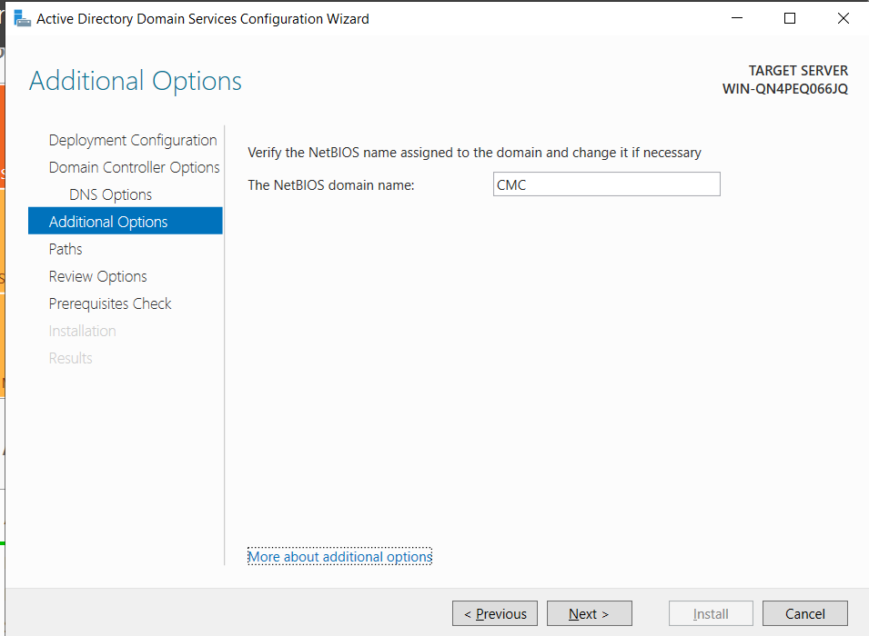

# **Active Directory Domain Services Configuration**

## **1. Get Active Directory Domain Services**

We will use Window Server 2022 OS for this lab. The following steps are required to configure Active Directory Domain Services (AD DS) on a Windows Server 2022 machine.

- Open Server Manager and click on **Add roles and features**.

- The **Before you begin** wizard appears. Click **Next** to continue
- The **Select installation type** section appears; leave the default options and click Next.
**Note:** Ensure that the **Role-based or feature-based installation** radio-button is selected.

- The **Select destination server** section appears. Choose the **Select a server from the server pool** radio button and click Next.

- Check **Active Directory Domain Services** from the **Roles** section in the **Select Server Roles** wizard and click **Next**.
**Note:** If the Add Roles and Features Wizard pop-up window appears, click Add Features.

- In the **Select features** section, click **Next** to continue
- The **Active Directory Domain Services** section appears; click **Next** to continue
- The **Confirm installation selections** section appears; check the **Restart the destination server automatically if required** option and click **Install**.
Note: If the **Add Roles and Features** Wizard pop-up window appears, click **Yes**.

- In the **Server Manager** window under **Dashboard**, click the **Flag** icon and click the **Promote this server to a domain controller** link, as shown in the screenshot

- The **Active Directory Domain Services Configuration Wizard** window appears. In the
**Deployment Configuration** section, select the **Add a new forest** radio button and type
**CMC.com** in the **Root domain name** field; click **Next**

- In the **Domain Controller Options** section, enter the password

- The **DNS Options** section appears. Ignore any alerts and click **Next**
- The **Additional Options** section appears; verify that the NetBIOS domain name is **CMC** and click Next.

- In the **Paths** section, click **Next**.
- The **Review Options** section appears; review your selection, and click **Next**

- Wait until the process finishes, and then click **Install** in the **Prerequisites Check** section

- Finally, here is my network configuration

## **2. Get the window workstation**

We will use Window 10 OS for this lab.

- This is my network configuration

- Go to **Access work or school** and click **Connect**

- Click **Join this device to local Active Directory domain**

- Enter the domain name **CMC.com**

- Enter the username and password of the domain administrator

- The **Add an account** wizard appears. Click **Skip** and restart the machine

- After restarting the machine, log in with the domain administrator account

