<div align='center'>

# **Lab 10: Credentialed Enumeration - from Linux** 

</div>

We will use the following credentials: User=forend and password=Klmcargo2

## **CrackMapExec**

**Domain User Enumeration**

```zsh
crackmapexec smb 172.16.5.5 -u forend -p Klmcargo2 --users
```

Here is the result

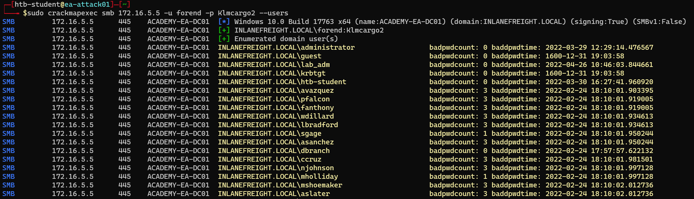

**Domain Group Enumeration**

```zsh
crackmapexec smb 172.16.5.5 -u forend -p Klmcargo2 --groups
```

Here is the result

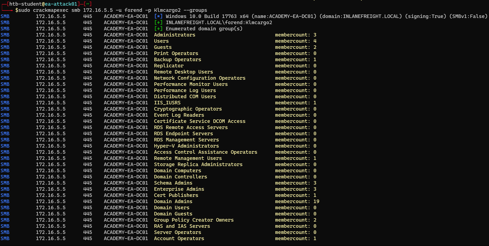

- **Question:** What is the membercount: of the "Interns" group?

    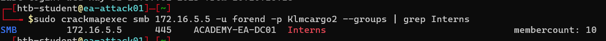

    - **Answer:** 10

    

**Logged On Users:** Show what users are logged in currently

```zsh
crackmapexec smb 172.16.5.130 -u forend -p Klmcargo2 --loggedon-users
```

Here is the result

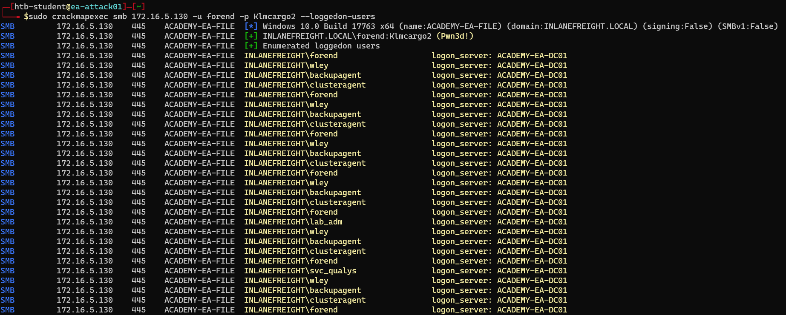

We can see that our user `forend` is a local admin because `(Pwn3d!)` appears after the tool successfully authenticates to the target host. A host like this may be used as a jump host or similar by administrative users

**Share Enumeration - Domain Controller:** Enumerate available shares on the remote host and the level of access our user account

```zsh
crackmapexec smb 172.16.5.5 -u forend -p Klmcargo2 --shares
```

Here is the result

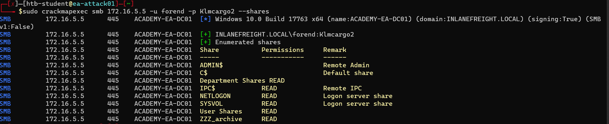

**Spider_plus:** Dig through each readable share on the host and list all readable files

```zsh
crackmapexec smb 172.16.5.5 -u forend -p Klmcargo2 -M spider_plus --share 'Department Shares'
```

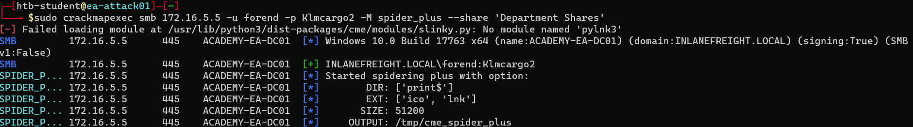

This command writes the results to a JSON file located at [/tmp/cme_spider_plus/172.16.5.5.json](../docs/172.16.5.5.json)

## **SMBMap**

**Check Access**

```zsh
smbmap -u forend -p Klmcargo2 -d INLANEFREIGHT.LOCAL -H 172.16.5.5
```

Here is the result

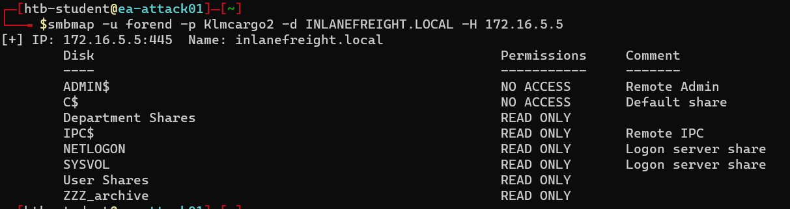

**Recursive List Of All Directories**

```zsh
smbmap -u forend -p Klmcargo2 -d INLANEFREIGHT.LOCAL -H 172.16.5.5 -R 'Department Shares'
```

Here is the result

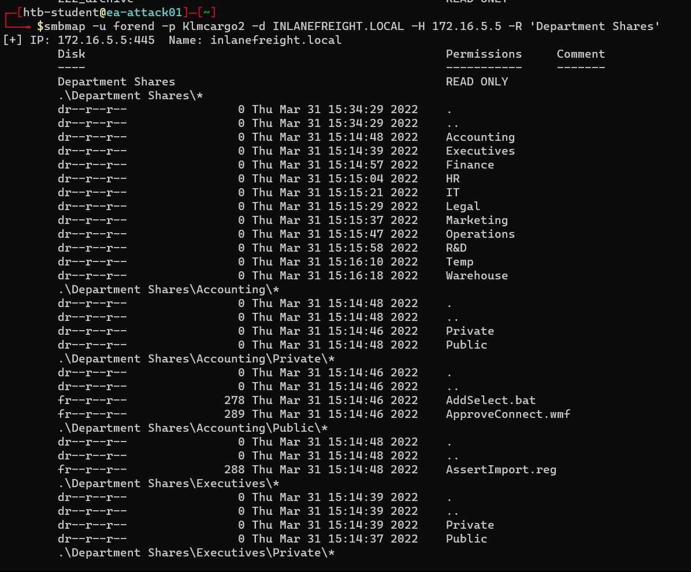

## **rpcclient**

```zsh
rpcclient -U "forend%Klmcargo2" 172.16.5.5
```

**Enumdomusers:** Print out all domain users by name and RID

```zsh
rpcclient $> enumdomusers
```

Here is the result

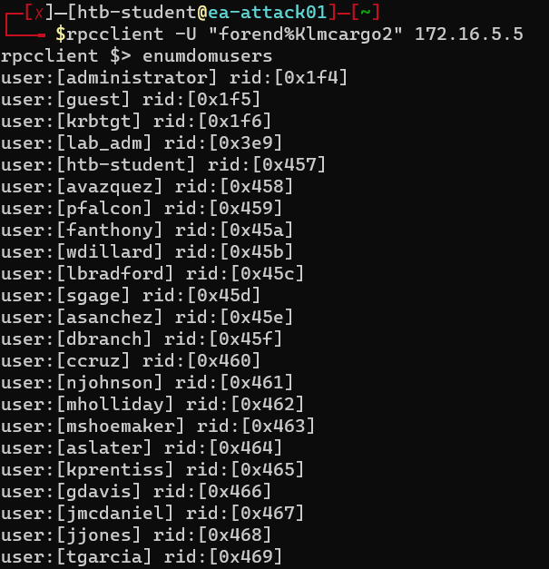

**User Enumeration By RID:**

```zsh
rpcclient $> queryuser 1170
```

Here is the result

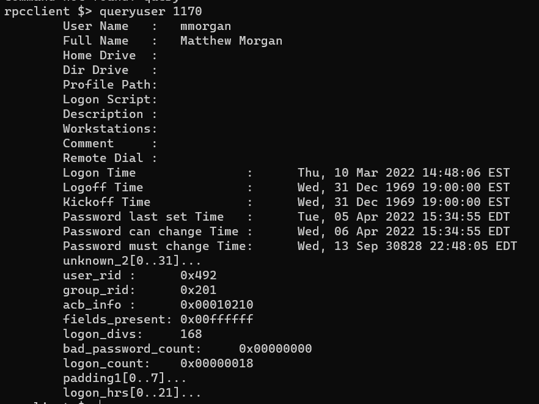

- **Question:** What is the full name of the user with RID 1170?

    - **Answer:** mmorgan

    

## **Windapsearch**

**Domain Admins:** Enumerate users from the Domain Admins group.

```zsh
python3 windapsearch.py --dc-ip 172.16.5.5 -u forend@inlanefreight.local -p Klmcargo2 --da
```

Here is the result

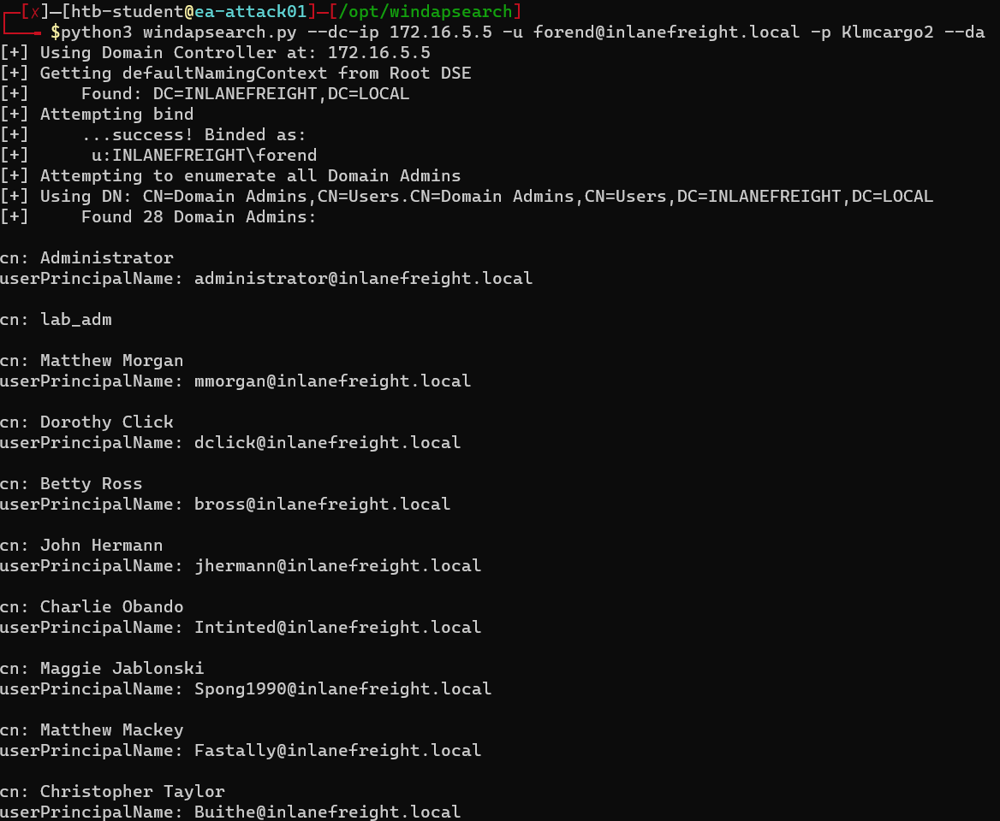

**Privileged Users:** Enumerate All privileged AD Users. Performs recursive lookups for nested members

```zsh
python3 windapsearch.py --dc-ip 172.16.5.5 -u forend@inlanefreight.local -p Klmcargo2 -PU
```

Here is the result

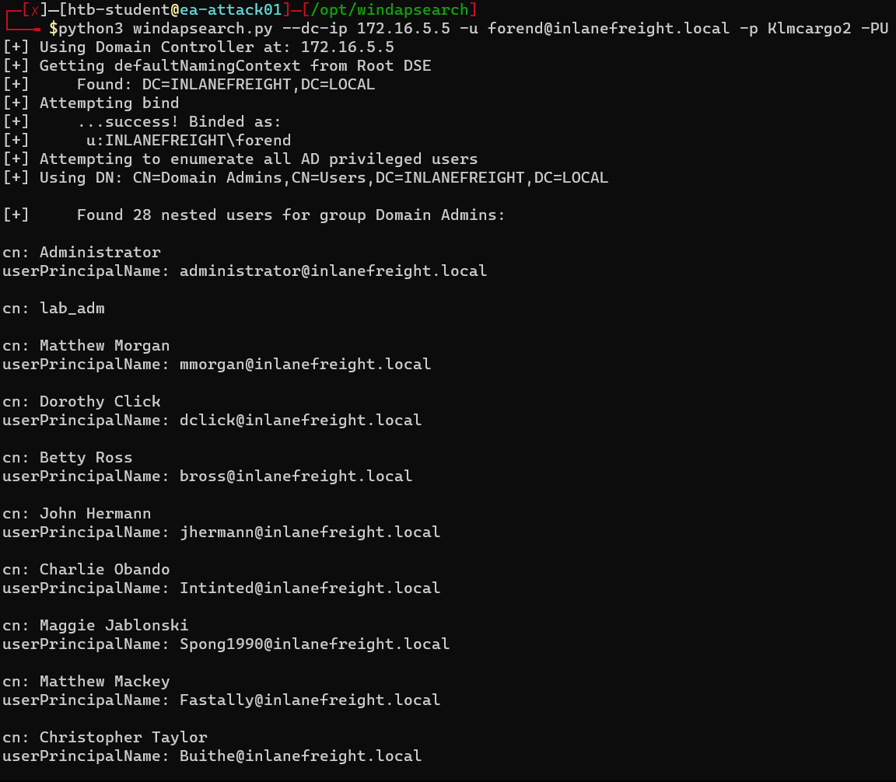

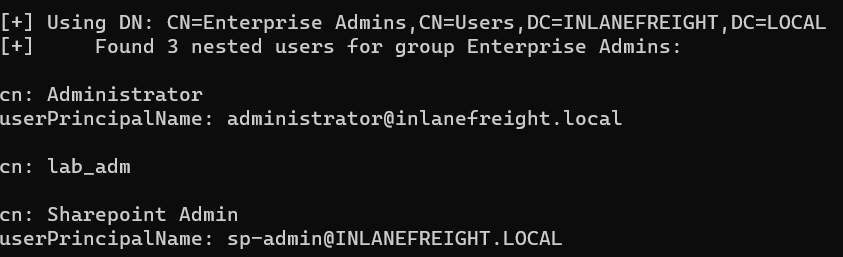

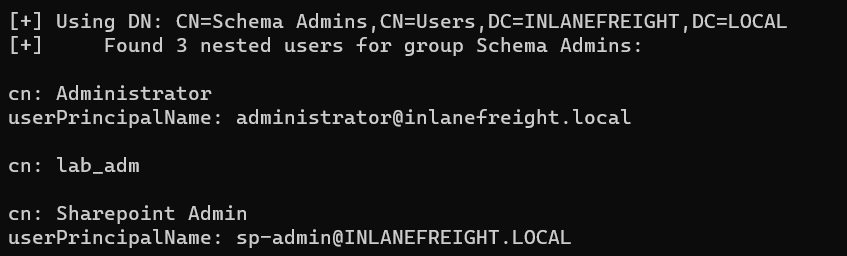