<div align='center'>

# **Lab 11: Credentialed Enumeration - from Windows** 

</div>

## **ActiveDirectory PowerShell Module**

**Get-ADDomain:** Print out the domain SID, domain functional level, any child domains, and more

Here is the result

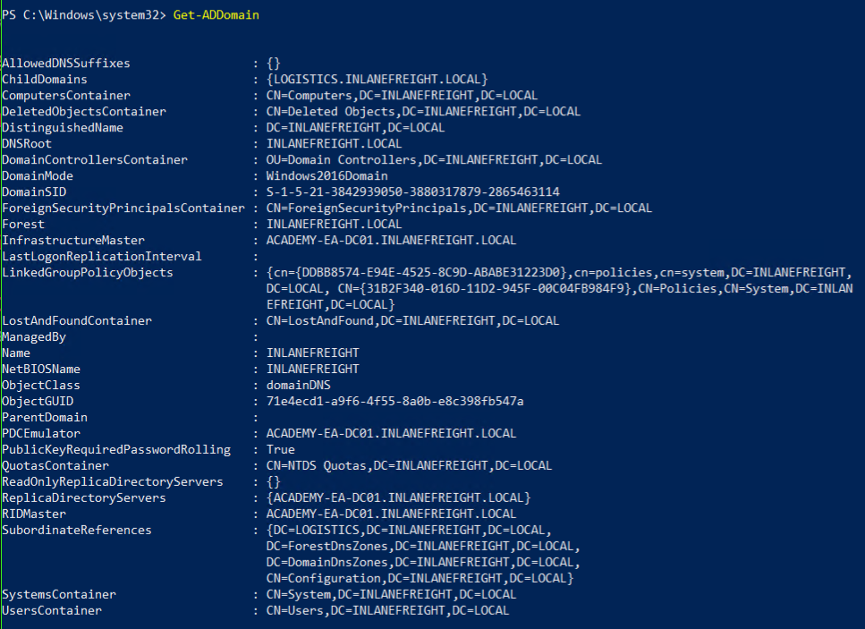

**Get-ADUser:** Gets one or more Active Directory users. We will be filtering for accounts with the ServicePrincipalName property populated. This will get us a listing of accounts that may be susceptible to a Kerberoasting attack

```powershell
Get-ADUser -Filter {ServicePrincipalName -ne "$null"} -Properties ServicePrincipalName
```

Here is the result

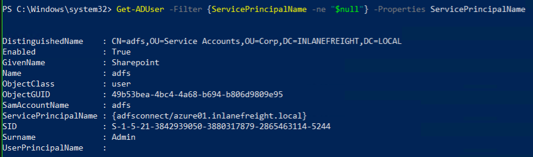

**Checking For Trust Relationships:** Print out any trust relationships the domain has

```powershell
Get-ADTrust -Filter *
```

Here is the result

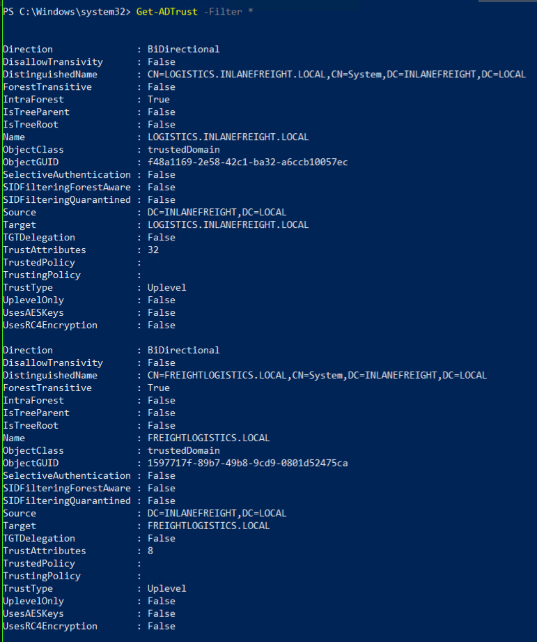

**Group Enumeration**

```powershell
Get-ADGroup -Filter * | select name
``` 

Here is the result

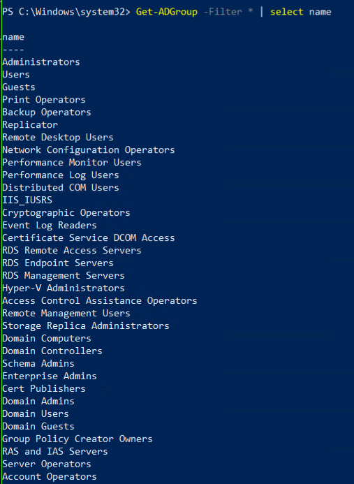

**Detailed Group Info**

```powershell
Get-ADGroup -Identity "Backup Operators"
```

Here is the result

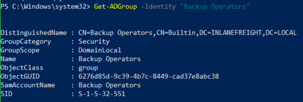

**Group Membership:** Print out the members of the group

```powershell
Get-ADGroupMember -Identity "Backup Operators"
```

We get a user `backupagent`

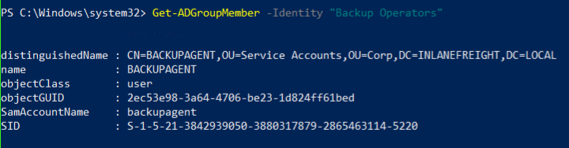

## **PowerView**

Start PowerView

```powershell
powershell -ep bypass
. .\PowerView.ps1
```

**Domain User Information**

```powershell   
Get-DomainUser -Identity wley -Domain inlanefreight.local
```

Here is the result

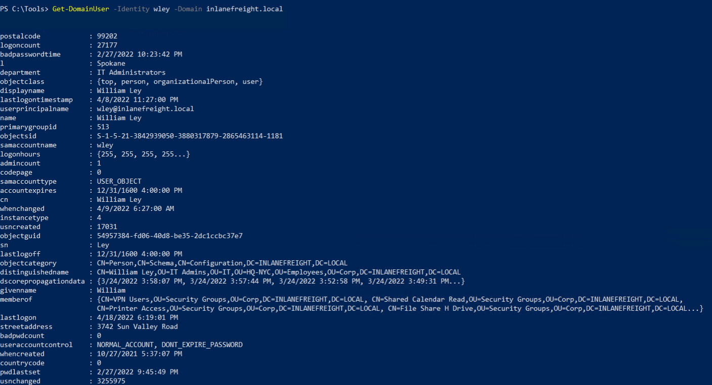

**Recursive Group Membership:** Retrieve group-specific information. Adding the `-Recurse` switch tells PowerView that if it finds any groups that are part of the target group (nested group membership) to list out the members of those groups

```powershell
Get-DomainGroupMember -Identity "Domain Admins" -Recurse
```

Here is the result

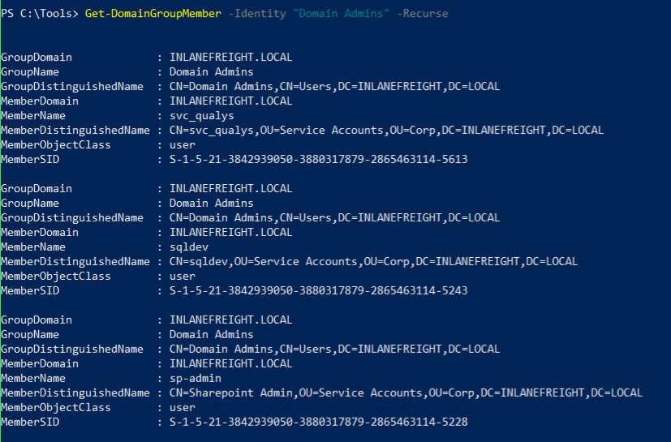

**Trust Enumeration**

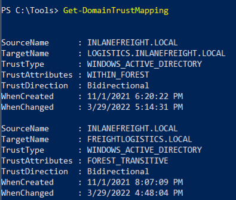

**Testing for Local Admin Access**

```powershell
Test-AdminAccess -ComputerName ACADEMY-EA-MS01
```

Here is the result

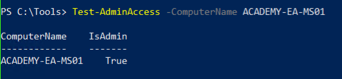

- **Question:** What PowerView function allows us to test if a user has administrative access to a local or remote host?

    - **Answer:** Test-AdminAccess


**Finding Users With SPN Set:** Check for users with the SPN attribute set, which indicates that the account may be subjected to a Kerberoasting attack

```powershell
Get-DomainUser -SPN -Properties samaccountname,ServicePrincipalName
```

Here is the result

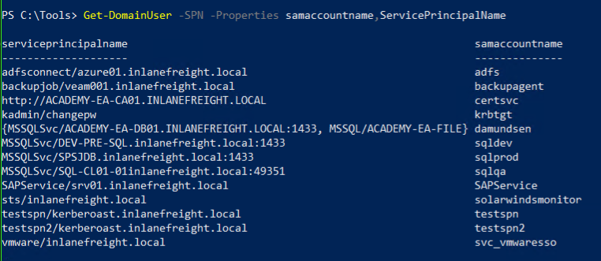

## **Snaffler**

Snaffler is a tool that can help us acquire credentials or other sensitive data in an Active Directory environment. Snaffler works by obtaining a list of hosts within the domain and then enumerating those hosts for shares and readable directories. Once that is done, it iterates through any directories readable by our user and hunts for files that could serve to better our position within the assessment.

```powershell
Snaffler.exe -s -d inlanefreight.local -v data
```

Here is the result

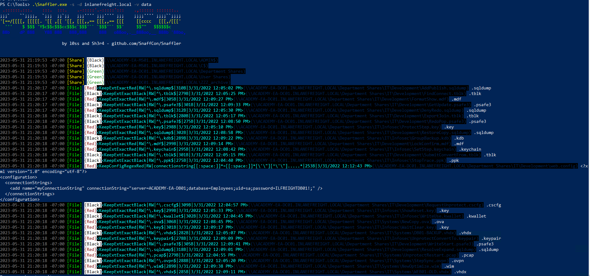

We can see a readable web config file which contains sensative information

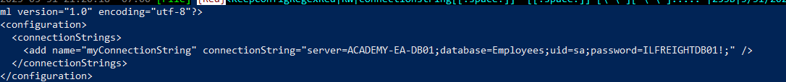

- **Question:** Run Snaffler and hunt for a readable web config file. What is the name of the user in the connection string within the file?

    - **Answer:** sa

- **Question:** What is the password for the database user?

    - **Answer:** ILFREIGHTDB01!

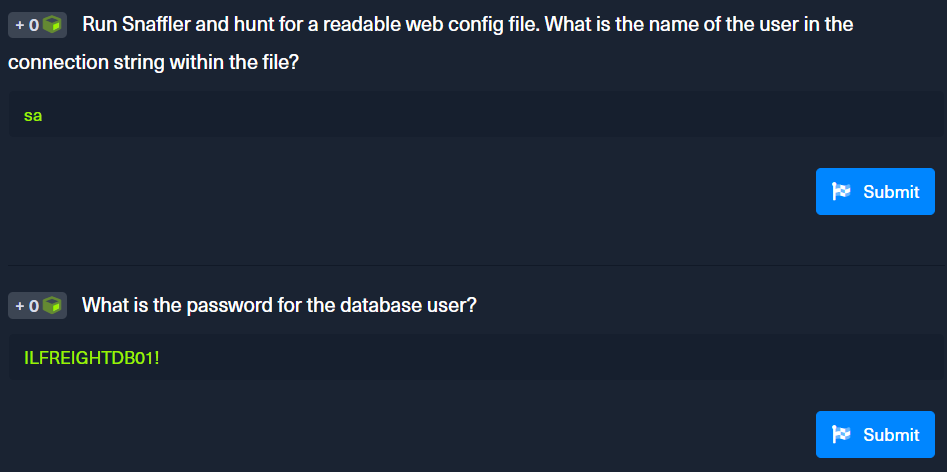

## **BloodHound/SharpHound**

Collecting information

```powershell
SharpHound.exe -c All --zipfilename ILFREIGHT
```


Load into BloodHound


**Analysis**

- `Find Computers with Unsupported Operating Systems` is great for finding outdated and unsupported operating systems running legacy software

    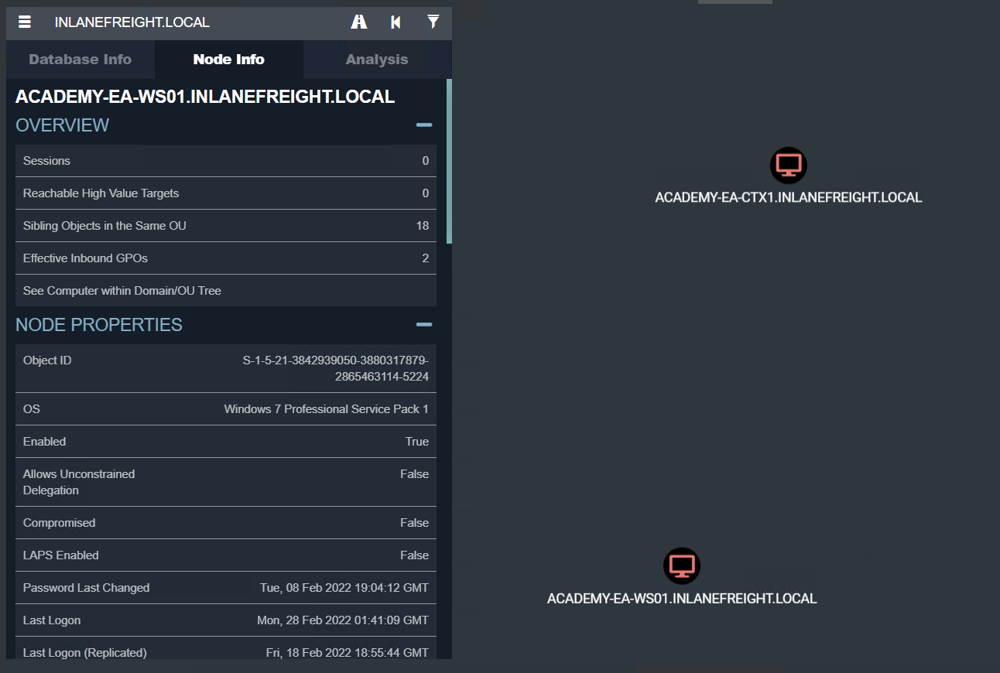

- `Find Computers where Domain Users are Local Admin` is great for finding any hosts where all users have local admin rights

    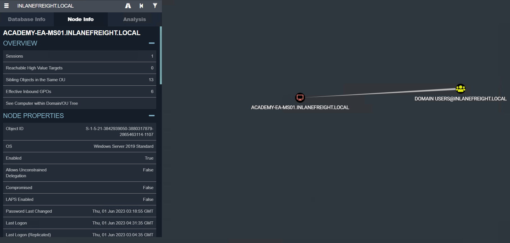

- **Question:** Using Bloodhound, determine how many Kerberoastable accounts exist within the INLANEFREIGHT domain. (Submit the number as the answer)

    Use the query `List all Kerberoastable Accounts`. We see 13 accounts

    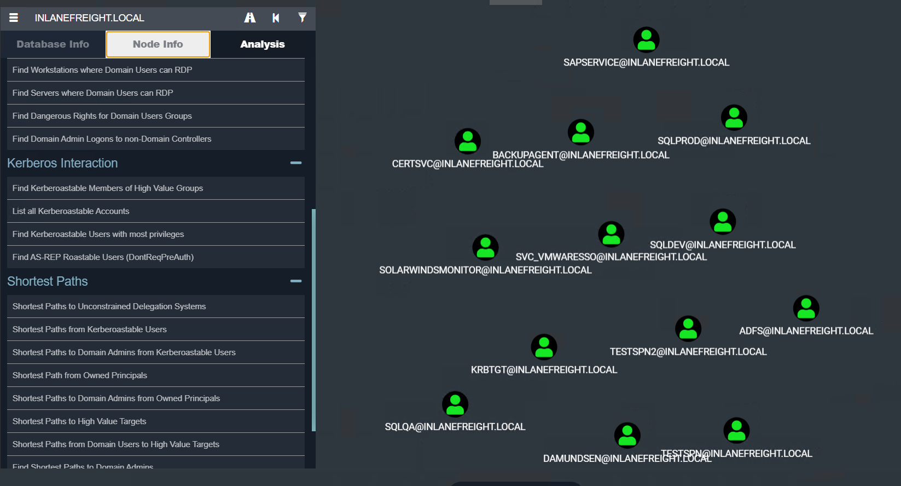

    - **Answer:** 13

    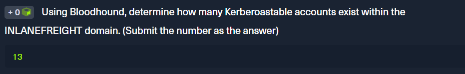
    
