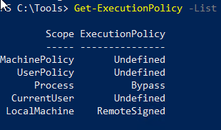
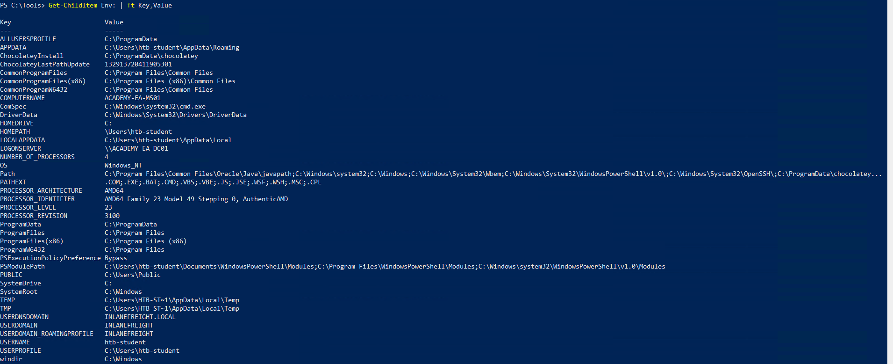
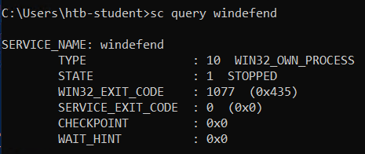
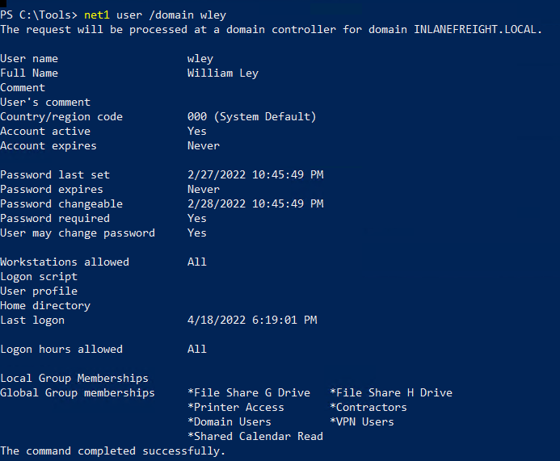
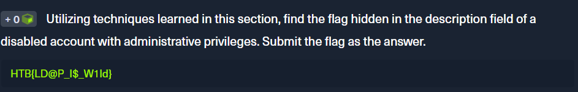

<div align='center'>

# **Lab 12: Living Off the Land** 

</div>

## **Env Commands For Host & Network Recon**

`Systeminfo` command will print a summary of the host's information


## **Harnessing PowerShell**

- `Get-Module`: List all the modules that are currently loaded into the PowerShell session

    

- `Get-ExecutionPolicy -List`: Print the execution policy settings for each scope on a host.

    

- `Get-ChildItem Env: | ft Key,Value`: Return environment values such as key paths, users, computer information, etc.

    

## **Downgrade Powershell**

Powershell version 2.0 or older will not be logged in Event Viewer

```powershell
powershell.exe -version 2
```


## **Checking Defenses**

**Firewall Checks**

```powershell
netsh advfirewall show allprofiles
```


**Windows Defender Check**

```powershell
sc query windefend
```



- **Get-MPComputerStatus**: Get the status and configuration settings of Windows Defender on the host

    

    - **Question**: Enumerate the host's security configuration information and return the hosts AMProductVersion.

        **Answer**: 4.18.2109.6

        

## **Network Information**

**arp -a:** Lists all known hosts stored in the arp table.


**Viewing the Routing Table**

```powershell
route print
```


**Windows Management Instrumentation (WMI)**

```powershell
wmic ntdomain get Caption,Description,DnsForestName,DomainName,DomainControllerAddress
```

This command provides the information about the domain and the child domain, and the external forest that our current domain has a trust with


## **net/net1 Commands**

**Listing Domain Groups**

```powershell
net1 group /domain
```


**Information about a Domain User**

```powershell
net1 user /domain wley
```



**Question**: What domain user is explicitly listed as a member of the local Administrators group on the target host?

```powershell
net1 localgroup administrators
```


- **Answer**: adunn


## **Dsquery**

**User Search**

```powershell
dsquery user
```


**Computer Search**

```powershell
dsquery computer
```


**Wildcard Search**

```powershell
dsquery * "CN=Users,DC=INLANEFREIGHT,DC=LOCAL"
```


**Users With Specific Attributes Set (Password not required)**

```powershell
dsquery * -filter "(&(objectCategory=person)(objectClass=user)(userAccountControl:1.2.840.113556.1.4.803:=32))" -attr distinguishedName userAccountControl
```


**Searching for Domain Controllers**

The below search filter looks for all Domain Controllers in the current domain, limiting to five results.


**Question**: Utilizing techniques learned in this section, find the flag hidden in the description field of a disabled account with administrative privileges. Submit the flag as the answer.

Look for disabled accounts and their description

```powershell
dsquery * -filter "(&(objectCategory=person)(objectClass=user)(userAccountControl:1.2.840.113556.1.4.803:=2))" -attr distinguishedName description
```


- **Answer**: HTB{LD@P_I$_W1ld}

