<div align='center'>

# **Lab 15: ACL Enumeration** 

</div>

## **Enumerating ACLs with PowerView**

**Using Get-DomainObjectACL**

Get the SID of the target user

```powershell
$sid = Convert-NameToSid wley
```

Perform an ACL enumeration on the target user

```powershell
Get-DomainObjectACL -ResolveGUIDs -Identity * | ? {$_.SecurityIdentifier -eq $sid}
```
We can see that the user has the right to force change the other user's password (Dana Amundsen:damundsen)

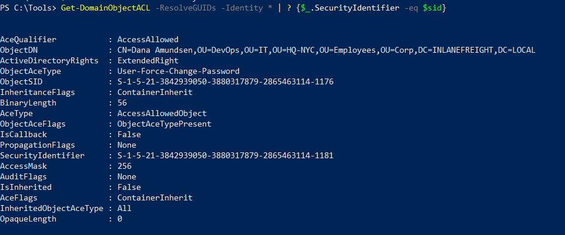

## **Without PowerView**

Creating a List of Domain Users

```powershell
Get-ADUser -Filter * | Select-Object -ExpandProperty SamAccountName > ad_users.txt
```

We then read each line of the file using a foreach loop, and use the `Get-Acl` cmdlet to retrieve ACL information for each domain user by feeding each line of the `ad_users.txt` file to the `Get-ADUser` cmdlet. We then select just the `Access property`, which will give us information about access rights. Finally, we set the `IdentityReference` property to the user we are in control of 

```powershell
foreach($line in [System.IO.File]::ReadLines("C:\Users\htb-student\Desktop\ad_users.txt")) {get-acl  "AD:\$(Get-ADUser $line)" | Select-Object Path -ExpandProperty Access | Where-Object {$_.IdentityReference -match 'INLANEFREIGHT\\wley'}}
```

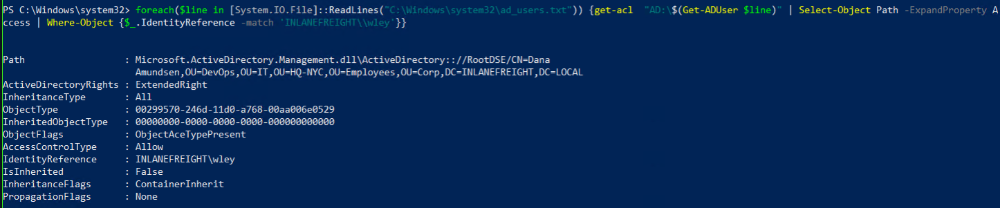

## **Further Enumeration of Rights (damundsen)**

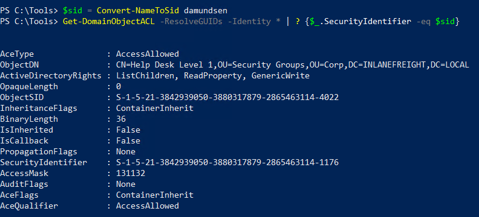

User `damundsen` has `GenericWrite` privileges over the `Help Desk Level 1` group. This means, among other things, that we can add any user (or ourselves) to this group and inherit any rights that this group has applied to it

**Investigating the Help Desk Level 1 Group with Get-DomainGroup**

```powershell
Get-DomainGroup -Identity "Help Desk Level 1" | select memberof
```

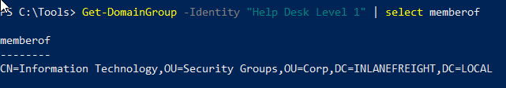

The `Help Desk Level 1` group is nested into the `Information Technology` group, meaning that we can obtain any rights that the `Information Technology` group grants to its members

**Investigating the Information Technology Group**

```powershell
$itgroupsid = Convert-NameToSid "Information Technology"
Get-DomainObjectACL -ResolveGUIDs -Identity * | ? {$_.SecurityIdentifier -eq $itgroupsid} -Verbose
```

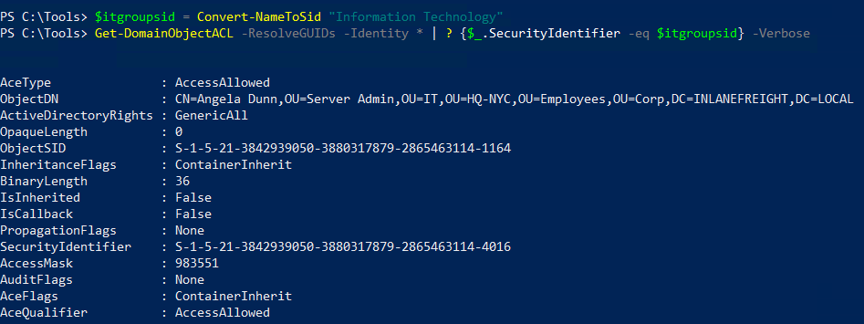

The result shows us that members of the `Information Technology` group have `GenericAll` rights over the user `adunn`

**Perform an ACL enumeration on the user adunn**


the `adunn` user has `DS-Replication-Get-Changes` and `DS-Replication-Get-Changes-In-Filtered-Set` rights over the domain object

**Question:** What is the rights GUID for User-Force-Change-Password?

- **Answer:** 00299570-246d-11d0-a768-00aa006e0529

    

**Question:** What flag can we use with PowerView to show us the ObjectAceType in a human-readable format during our enumeration?

- **Answer:** ResolveGUIDs

    

**Question:** What privileges does the user damundsen have over the Help Desk Level 1 group?

- **Answer:** GenericWrite

    

**Question:** Using the skills learned in this section, enumerate the ActiveDirectoryRights that the user `forend` has over the user `dpayne` (Dagmar Payne).

```powershell
$sid3 = Convert-NameToSid forend
Get-DomainObjectACL -ResolveGUIDs -Identity * | ? {$_.SecurityIdentifier -eq $sid3}
```

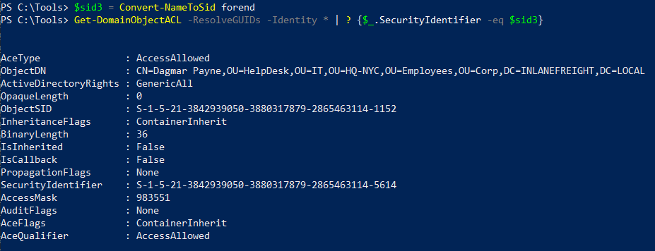

- **Answer:** GenericAll

    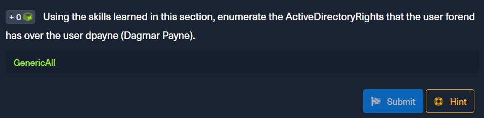

**Question:** What is the ObjectAceType of the first right that the forend user has over the GPO Management group? (two words in the format Word-Word)

```powershell
Get-DomainObjectACL -SearchBase "CN=GPO MANAGEMENT,OU=SECURITY GROUPS,OU=CORP,DC=INLANEFREIGHT,DC=LOCAL" -ResolveGUIDs | ? {$_.SecurityIdentifier -eq $sid3} -Verbose
```

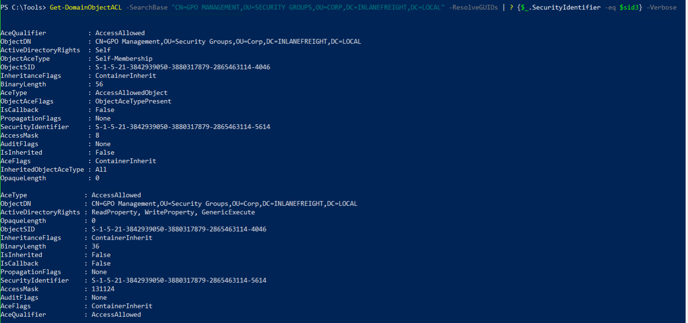

- **Answer:** Self-Membership

    

## **Enumerating ACLs with BloodHound/SharpHound**
    
**Collecting information**

```powershell
SharpHound.exe -c All --zipfilename ILFREIGHT
```


**Load into BloodHound**

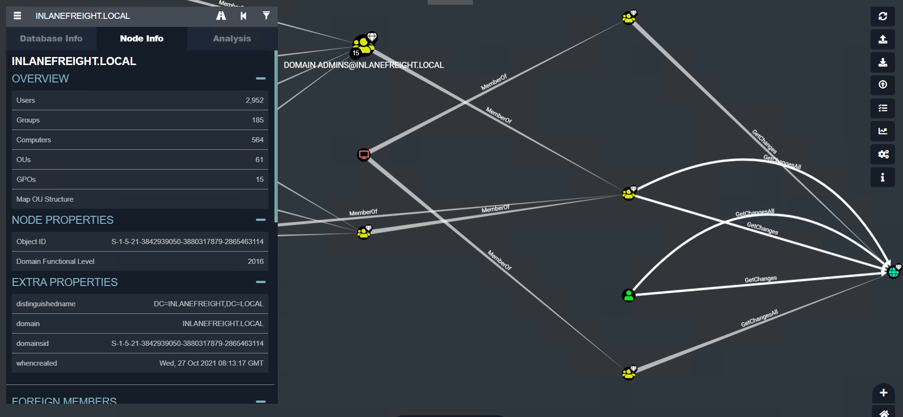

**Viewing Node Info through BloodHound**

`wley` has the right to force change the password over `damundsen` user

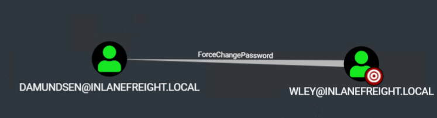

**Viewing Potential Attack Paths through BloodHound**

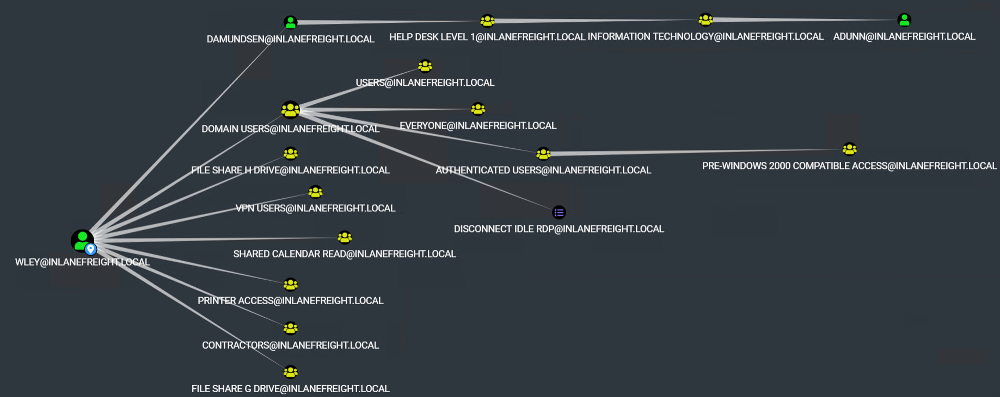

**Viewing Pre-Build queries through BloodHound**

We can use the pre-built queries in BloodHound to confirm that the adunn user has DCSync rights: `Find Principals with DCSync Rights`

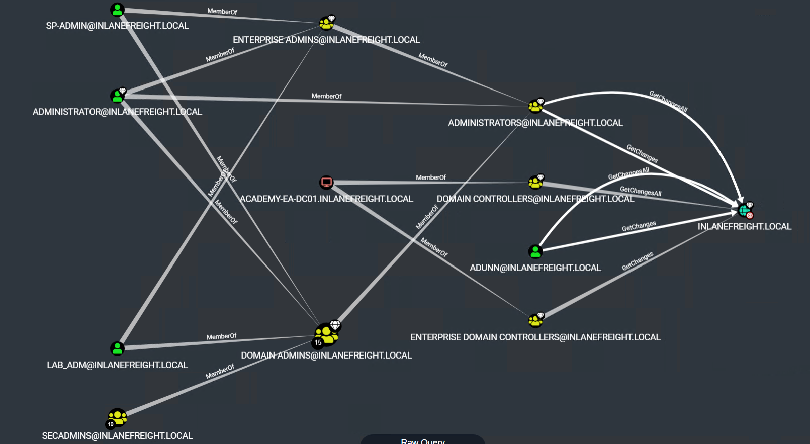