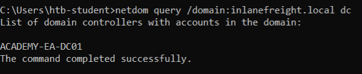

<div align='center'>

# **Lab 21: Domain Trusts Primer** 

</div>

## **Enumerating Trust Relationships**

**Using Get-ADTrust**

```powershell
Get-ADTrust -Filter *
```


The above output shows that our current domain INLANEFREIGHT.LOCAL has two domain trusts. The first is with LOGISTICS.INLANEFREIGHT.LOCAL, and the IntraForest property shows that this is a child domain, and we are currently positioned in the root domain of the forest. The second trust is with the domain FREIGHTLOGISTICS.LOCAL, and the ForestTransitive property is set to True, which means that this is a forest trust or external trust. We can see that both trusts are set up to be bidirectional, meaning that users can authenticate back and forth across both trusts

**Using Get-DomainTrust (Powerview)**


**Question:** What is the child domain of INLANEFREIGHT.LOCAL? (format: FQDN, i.e., DEV.ACME.LOCAL)
- **Answer:** LOGISTICS.INLANEFREIGHT.LOCAL

**Question:** What domain does the INLANEFREIGHT.LOCAL domain have a forest transitive trust with?
- **Answer:** FREIGHTLOGISTICS.LOCAL

**Question:** What direction is this trust?
- **Answer:** Bidirectional


**Using netdom to query domain trust**

```batch
netdom query /domain:inlanefreight.local trust
```


**Using netdom to query domain controllers**

```batch
netdom query /domain:inlanefreight.local dc
```



**Using netdom to query domain controllers in the child domain**

```batch
netdom query /domain:inlanefreight.local workstation
```

