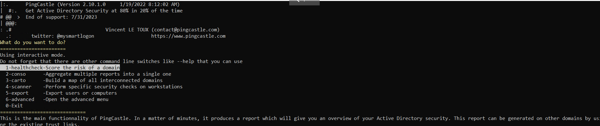

# **Lab 26: Additional AD Auditing Techniques** 

## **Creating an AD Snapshot with Active Directory Explorer**

AD Explorer can also be used to save snapshots of an AD database for offline viewing and comparison. We can take a snapshot of AD at a point in time and explore it later, during the reporting phase, as you would explore any other database. It can also be used to perform a before and after comparison of AD to uncover changes in objects, attributes, and security permissions.

**Logging in with AD Explorer**

Log in with any valid domain user

**Browsing AD with AD Explorer**

**Creating a Snapshot of AD with AD Explorer**

Go to File &rarr; Create Snapshot and enter a name for the snapshot

## **PingCastle**

[PingCastle](https://www.pingcastle.com/documentation/) is a powerful tool that evaluates the security posture of an AD environment and provides us the results in several different maps and graphs.

**Running PingCastle**

The default option is the healthcheck run, which will establish a baseline overview of the domain, and provide us with pertinent information dealing with misconfigurations and vulnerabilities. Even better, PingCastle can report recent vulnerability susceptibility, our shares, trusts, the delegation of permissions, and much more about our user and computer states. Under the Scanner option, we can find most of these checks.

**Running a Healthcheck**

**Viewing the Healthcheck Results**

Here is the result [file](../docs/ad_hc_inlanefreight.local.html)

## **Group3r**

Group3r is a tool purpose-built to find vulnerabilities in Active Directory associated Group Policy. Group3r must be run from a domain-joined host with a domain user (it does not need to be an administrator), or in the context of a domain user (i.e., using `runas /netonly`)

**Group3r Basic Usage**

When running Group3r, we must specify the -s or the -f flag. These will specify whether to send results to stdout (-s), or to the file we want to send the results to (-f).

**Reading Output**

## **ADRecon**

**Running ADRecon**

ADRecon will drop a report for us in a new folder under the directory we executed from. You will get a report in HTML format and a folder with CSV results

