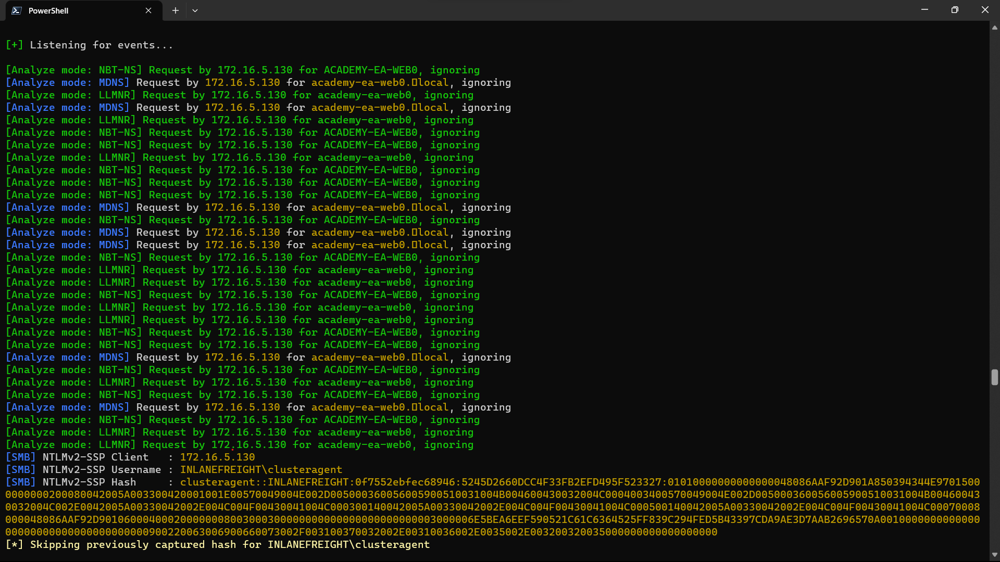
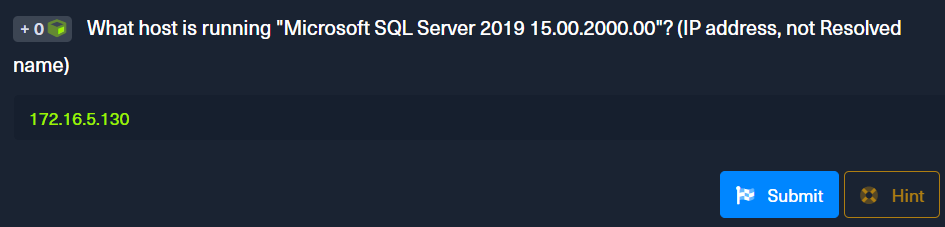

<div align='center'>

# **Lab 2: Initial Enumeration of the Domain** 

</div>

## **Identifying Hosts**

**Responder tool**

- Responder is a tool built to listen, analyze, and poison LLMNR, NBT-NS, and MDNS requests and responses

- Command

    ```zsh
    sudo responder -I ens224 -A
    ```

- Here is the result

    
    
**FPing Active Checks**
    
- Command

    ```zsh
    fping -asgq 172.16.5.0/23
    ```
    
    - **-a**: show targets that are alive
    - **-s**: print stats at the end of the scan
    - **-g**: generate a target list from the CIDR network
    - **-q**: not show per-target results

**Nmap Scanning**

- Command

    ```zsh
    nmap -A 172.16.5.130
    ```
- Result

    ```
    Starting Nmap 7.92 ( https://nmap.org ) at 2023-05-30 05:10 EDT
    Nmap scan report for 172.16.5.130
    Host is up (0.086s latency).
    Not shown: 992 closed tcp ports (conn-refused)
    PORT      STATE SERVICE       VERSION
    80/tcp    open  http          Microsoft HTTPAPI httpd 2.0 (SSDP/UPnP)
    135/tcp   open  msrpc         Microsoft Windows RPC
    139/tcp   open  netbios-ssn   Microsoft Windows netbios-ssn
    445/tcp   open  microsoft-ds?
    808/tcp   open  ccproxy-http?
    1433/tcp  open  ms-sql-s      Microsoft SQL Server 2019 15.00.2000.00; RTM
    | ssl-cert: Subject: commonName=SSL_Self_Signed_Fallback
    | Not valid before: 2023-05-30T08:14:59
    |_Not valid after:  2053-05-30T08:14:59
    |_ssl-date: 2023-05-30T09:11:50+00:00; 0s from scanner time.
    | ms-sql-ntlm-info:
    |   Target_Name: INLANEFREIGHT
    |   NetBIOS_Domain_Name: INLANEFREIGHT
    |   NetBIOS_Computer_Name: ACADEMY-EA-FILE
    |   DNS_Domain_Name: INLANEFREIGHT.LOCAL
    |   DNS_Computer_Name: ACADEMY-EA-FILE.INLANEFREIGHT.LOCAL
    |   DNS_Tree_Name: INLANEFREIGHT.LOCAL
    |_  Product_Version: 10.0.17763
    3389/tcp  open  ms-wbt-server Microsoft Terminal Services
    |_ssl-date: 2023-05-30T09:11:50+00:00; 0s from scanner time.
    | ssl-cert: Subject: commonName=ACADEMY-EA-FILE.INLANEFREIGHT.LOCAL
    | Not valid before: 2023-05-29T08:14:43
    |_Not valid after:  2023-11-28T08:14:43
    | rdp-ntlm-info:
    |   Target_Name: INLANEFREIGHT
    |   NetBIOS_Domain_Name: INLANEFREIGHT
    |   NetBIOS_Computer_Name: ACADEMY-EA-FILE
    |   DNS_Domain_Name: INLANEFREIGHT.LOCAL
    |   DNS_Computer_Name: ACADEMY-EA-FILE.INLANEFREIGHT.LOCAL
    |   DNS_Tree_Name: INLANEFREIGHT.LOCAL
    |   Product_Version: 10.0.17763
    |_  System_Time: 2023-05-30T09:10:46+00:00
    16001/tcp open  mc-nmf        .NET Message Framing
    Service Info: OS: Windows; CPE: cpe:/o:microsoft:windows

    Host script results:
    | smb2-time:
    |   date: 2023-05-30T09:10:46
    |_  start_date: N/A
    | smb2-security-mode:
    |   3.1.1:
    |_    Message signing enabled but not required
    |_nbstat: NetBIOS name: ACADEMY-EA-FILE, NetBIOS user: <unknown>, NetBIOS MAC: 00:50:56:b9:93:af (VMware)
    | ms-sql-info:
    |   172.16.5.130:1433:
    |     Version:
    |       name: Microsoft SQL Server 2019 RTM
    |       number: 15.00.2000.00
    |       Product: Microsoft SQL Server 2019
    |       Service pack level: RTM
    |       Post-SP patches applied: false
    |_    TCP port: 1433
    ```
    - **Question:** What host is running "Microsoft SQL Server 2019 15.00.2000.00"? (IP address, not Resolved name)
        
        **Answer:** 172.16.5.130

        

- Result for command `nmap -A 172.16.5.5`

    ```
    Starting Nmap 7.92 ( https://nmap.org ) at 2023-05-30 08:59 EDT
    Nmap scan report for inlanefreight.local (172.16.5.5)
    Host is up (0.047s latency).
    Not shown: 988 closed tcp ports (conn-refused)
    PORT     STATE SERVICE       VERSION
    53/tcp   open  domain        Simple DNS Plus
    88/tcp   open  kerberos-sec  Microsoft Windows Kerberos (server time: 2023-05-30 12:59:30Z)
    135/tcp  open  msrpc         Microsoft Windows RPC
    139/tcp  open  netbios-ssn   Microsoft Windows netbios-ssn
    389/tcp  open  ldap          Microsoft Windows Active Directory LDAP (Domain: INLANEFREIGHT.LOCAL0., Site: Default-First-Site-Name)
    |_ssl-date: 2023-05-30T13:00:17+00:00; -1s from scanner time.
    | ssl-cert: Subject:
    | Subject Alternative Name: DNS:ACADEMY-EA-DC01.INLANEFREIGHT.LOCAL
    | Not valid before: 2022-03-30T22:40:24
    |_Not valid after:  2023-03-30T22:40:24
    445/tcp  open  microsoft-ds?
    464/tcp  open  kpasswd5?
    593/tcp  open  ncacn_http    Microsoft Windows RPC over HTTP 1.0
    636/tcp  open  ssl/ldap      Microsoft Windows Active Directory LDAP (Domain: INLANEFREIGHT.LOCAL0., Site: Default-First-Site-Name)
    | ssl-cert: Subject:
    | Subject Alternative Name: DNS:ACADEMY-EA-DC01.INLANEFREIGHT.LOCAL
    | Not valid before: 2022-03-30T22:40:24
    |_Not valid after:  2023-03-30T22:40:24
    |_ssl-date: 2023-05-30T13:00:17+00:00; -1s from scanner time.
    3268/tcp open  ldap          Microsoft Windows Active Directory LDAP (Domain: INLANEFREIGHT.LOCAL0., Site: Default-First-Site-Name)
    |_ssl-date: 2023-05-30T13:00:17+00:00; -1s from scanner time.
    | ssl-cert: Subject:
    | Subject Alternative Name: DNS:ACADEMY-EA-DC01.INLANEFREIGHT.LOCAL
    | Not valid before: 2022-03-30T22:40:24
    |_Not valid after:  2023-03-30T22:40:24
    3269/tcp open  ssl/ldap      Microsoft Windows Active Directory LDAP (Domain: INLANEFREIGHT.LOCAL0., Site: Default-First-Site-Name)
    |_ssl-date: 2023-05-30T13:00:17+00:00; -1s from scanner time.
    | ssl-cert: Subject:
    | Subject Alternative Name: DNS:ACADEMY-EA-DC01.INLANEFREIGHT.LOCAL
    | Not valid before: 2022-03-30T22:40:24
    |_Not valid after:  2023-03-30T22:40:24
    3389/tcp open  ms-wbt-server Microsoft Terminal Services
    | rdp-ntlm-info:
    |   Target_Name: INLANEFREIGHT
    |   NetBIOS_Domain_Name: INLANEFREIGHT
    |   NetBIOS_Computer_Name: ACADEMY-EA-DC01
    |   DNS_Domain_Name: INLANEFREIGHT.LOCAL
    |   DNS_Computer_Name: ACADEMY-EA-DC01.INLANEFREIGHT.LOCAL
    |   Product_Version: 10.0.17763
    |_  System_Time: 2023-05-30T13:00:09+00:00
    | ssl-cert: Subject: commonName=ACADEMY-EA-DC01.INLANEFREIGHT.LOCAL
    | Not valid before: 2023-05-29T12:50:19
    |_Not valid after:  2023-11-28T12:50:19
    |_ssl-date: 2023-05-30T13:00:17+00:00; -1s from scanner time.
    Service Info: Host: ACADEMY-EA-DC01; OS: Windows; CPE: cpe:/o:microsoft:windows

    Host script results:
    |_nbstat: NetBIOS name: ACADEMY-EA-DC01, NetBIOS user: <unknown>, NetBIOS MAC: 00:50:56:b9:8c:fb (VMware)
    | smb2-security-mode:
    |   3.1.1:
    |_    Message signing enabled and required
    |_clock-skew: mean: -1s, deviation: 0s, median: -1s
    | smb2-time:
    |   date: 2023-05-30T13:00:09
    |_  start_date: N/A

    Service detection performed. Please report any incorrect results at https://nmap.org/submit/ .
    Nmap done: 1 IP address (1 host up) scanned in 53.95 seconds
    ```
    - **Question:** From your scans, what is the "commonName" of host 172.16.5.5 ?
        
        **Answer:** ACADEMY-EA-DC01.INLANEFREIGHT.LOCAL

        