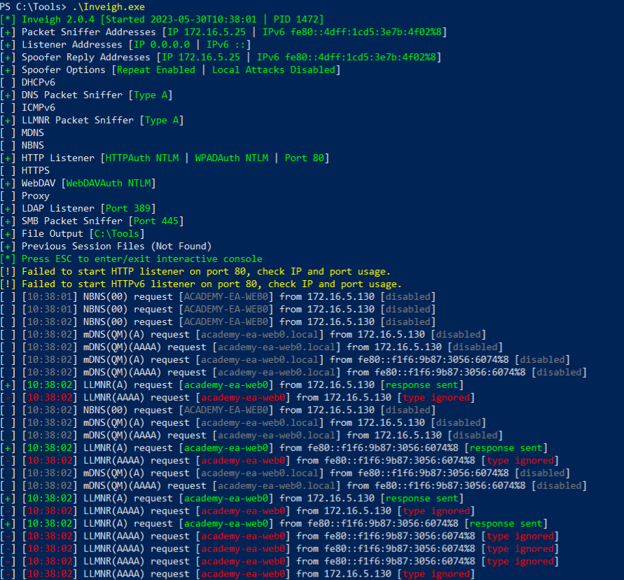
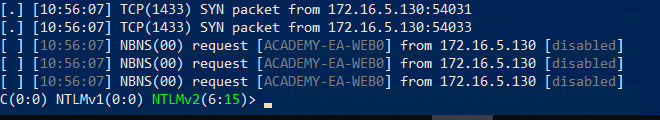
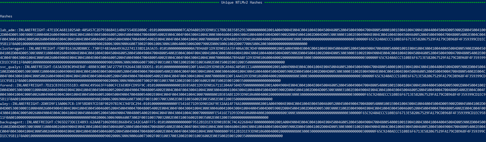
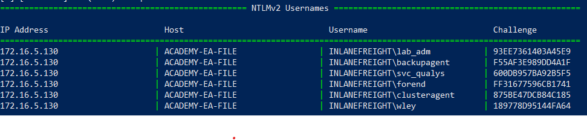
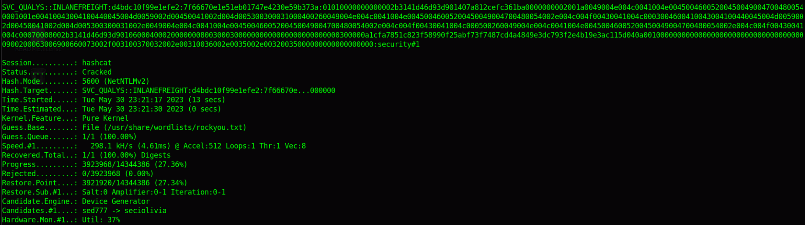
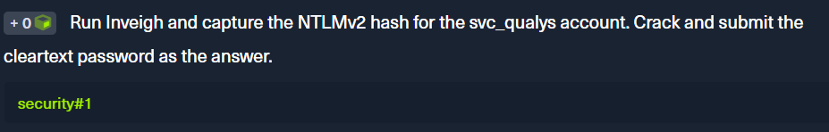
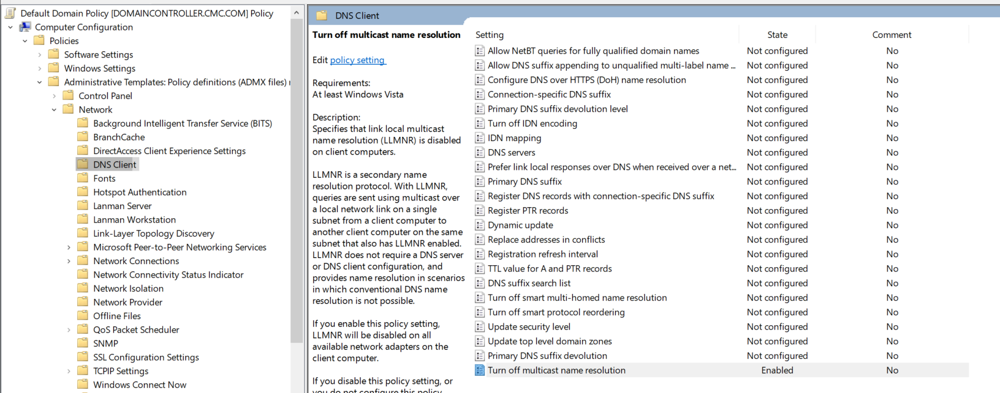
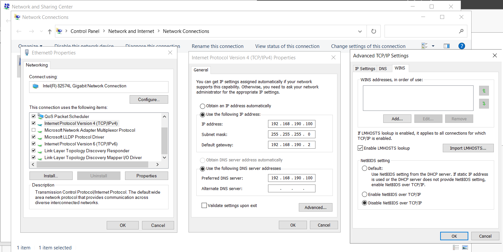
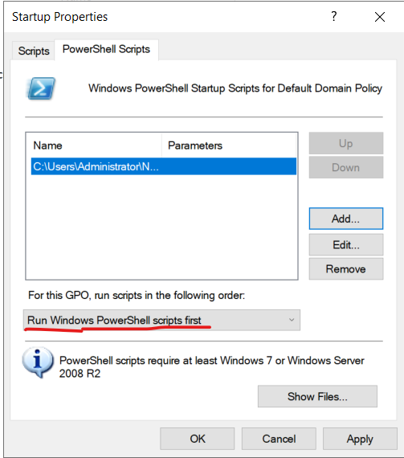
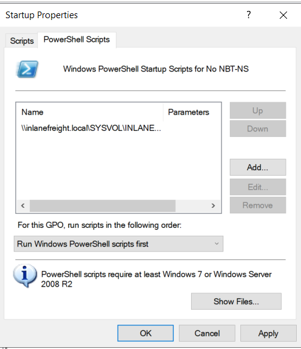

<div align='center'>

# **Lab 5: LLMNR/NBT-NS Poisoning - from Windows** 

</div>

## **Using Inveigh**



- Press `Esc` to enter the interactive console

    

- Command `GET NTLMV2UNIQUE` to view unique captured hashes

    

- Command `GET NTLMV2USERNAMES` return the list of usernames    

    
    
## **Cracking an NTLMv2 Hash With Hashcat**

- Store each user's hash in a separate file:

    ```zsh
    echo <user's hashes> > <user's name>
    ```

- Use Hashcat to crack the hash:

    ```zsh
    hashcat -m 5600 <hash file> <wordlist>
    ```
    - Here is the result for account `svc_qualys`

    

    Look at the result, we can see that the password is `security#1`
    
- **Question:** Run Inveigh and capture the NTLMv2 hash for the svc_qualys account. Crack and submit the cleartext password as the answer.

    **Answer:** security#1

    

## **Remediation**

**Disable LLMNR and NBT-NS**

- We can disable LLMNR in Group Policy by going to **Computer Configuration** &rarr; **Policies** &rarr; **Administrative Templates** &rarr; **Network** &rarr; **DNS Client** and enabling "**Turn OFF Multicast Name Resolution**

    

- NBT-NS cannot be disabled via Group Policy but must be disabled locally on each host. We can do this by opening **Network and Sharing Center**, clicking on **Change adapter settings**, right-clicking on the adapter to view its properties, selecting **Internet Protocol Version 4 (TCP/IPv4)**, and clicking the **Properties** button, then clicking on **Advanced** and selecting the **WINS** tab and finally selecting **Disable NetBIOS over TCP/IP**

    

    Or we can create a new Group Policy Object which host a script to disable NBT-NS. The script will be run at startup on the hosts in a domain.

    - Create a PowerShell script like below, save it to a file

        ```powershell
        $regkey = "HKLM:SYSTEM\CurrentControlSet\services\NetBT\Parameters\Interfaces"
        Get-ChildItem $regkey |foreach { Set-ItemProperty -Path "$regkey\$($_.pschildname)" -Name NetbiosOptions -Value 2 -Verbose}
        ```
    - Under **Computer Configuration** &rarr; **Windows Settings** &rarr; **Script (Startup/Shutdown)** &rarr; **Startup**, double click on Startup, choose the newly created script, then configured it like below

        

    - To push this out to all hosts in a domain, create a GPO using **Group Policy Management** on the Domain Controller and host the script on the SYSVOL share in the scripts folder and then call it via its UNC path such as

        ```
        \\inlanefreight.local\SYSVOL\INLANEFREIGHT.LOCAL\scripts
        ```

        

- Filtering network traffic to block LLMNR/NetBIOS traffic
- Enabling SMB Signing
- Implement network intrusion detection and prevention systems

## **Detection**

- Injecting LLMNR and NBT-NS requests for non-existent hosts across different subnets and alerting if any of the responses receive answers which would be indicative of an attacker spoofing name resolution responses
- Hosts can be monitored for traffic on ports UDP 5355 and 137, and event IDs 4697 and 7045 can be monitored for
- Monitor the registry key `HKLM\Software\Policies\Microsoft\Windows NT\DNSClient` for changes to the `EnableMulticast` `DWORD` value