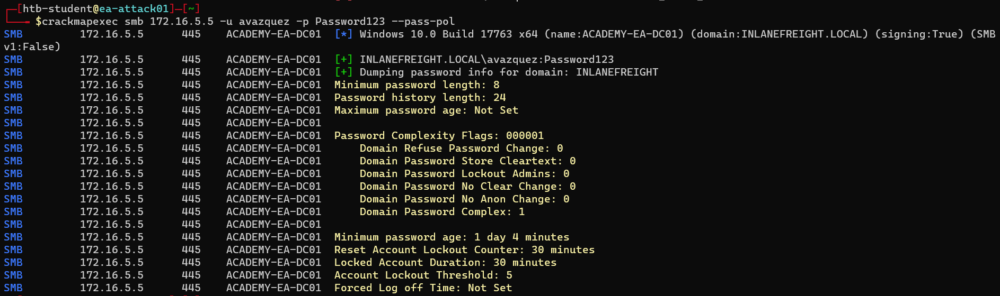
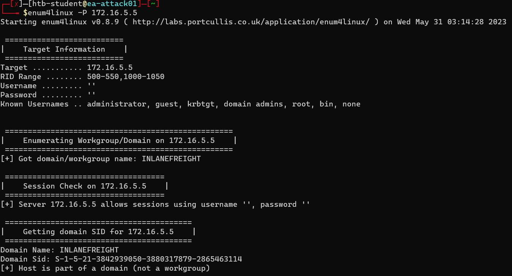
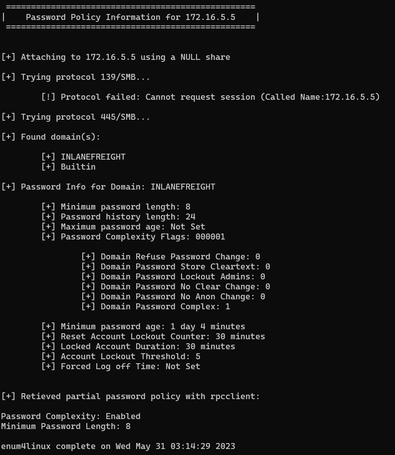
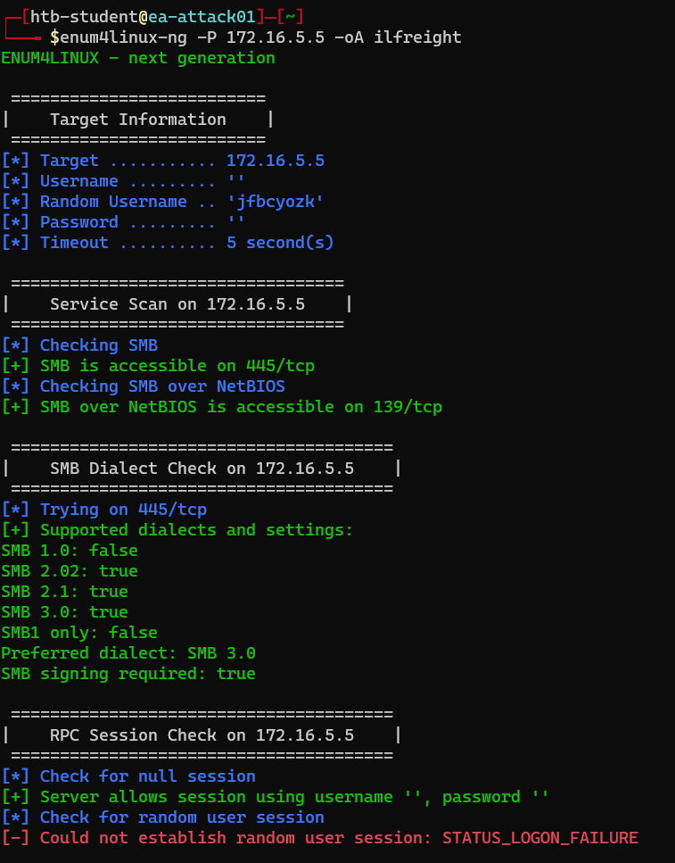
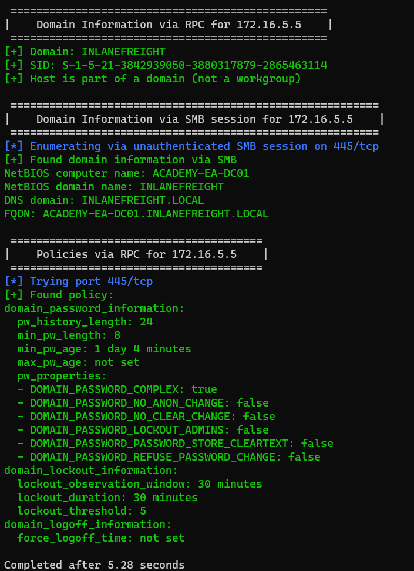
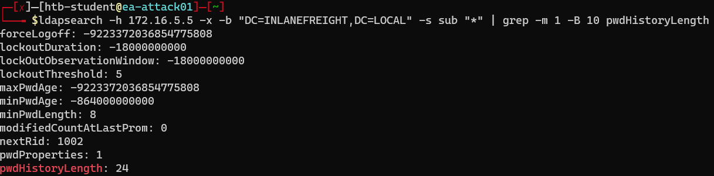
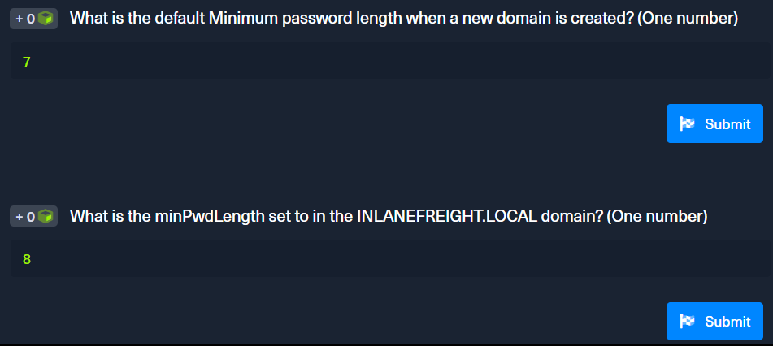

<div align='center'>

# **Lab 6: Enumerating & Retrieving Password Policies** 

</div>

## **1) From Linux**

### **Credentialed**

- With valid domain credentials, the password policy can also be obtained remotely using tools such as CrackMapExec

- Command

    ```zsh
    crackmapexec smb 172.16.5.5 -u avazquez -p Password123 --pass-pol
    ```

- Look at the result, we can see that the password policy is:

    ```
    Password Complexity: Enabled
    Minimum Password Length: 8
    Password History Length: 24
    Maximum Password Age: 1 day and 4 minutes
    Minimum Password Age: 0
    Reset Account Lockout Counter: 30 minutes
    Locked Account Duration: 30 minutes
    Account Lockout Threshold: 5
    Forced Log off Time: Not Set
    ```

    

### **SMB NULL Sessions**

**Using rpcclient**

```zsh
rpcclient -U "" -N 172.16.5.5
```

Use `querydominfo` to obtain information about the domain and confirm NULL session access

```zsh
rpcclient $> querydominfo
Domain:         INLANEFREIGHT
Server:
Comment:
Total Users:    3509
Total Groups:   0
Total Aliases:  203
Sequence No:    1
Force Logoff:   -1
Domain Server State:    0x1
Server Role:    ROLE_DOMAIN_PDC
Unknown 3:      0x1
```

Use `getdompwinfo` to obtain the Password Policy

```zsh
rpcclient $> getdompwinfo
min_password_length: 8
password_properties: 0x00000001
        DOMAIN_PASSWORD_COMPLEX
```

We can see that the password policy is relatively weak, allowing a minimum password of 8 characters

**Using enum4linux**

```zsh
enum4linux -P 172.16.5.5
```

Here is the result





**Using enum4linux-ng**

```zsh
enum4linux-ng -P 172.16.5.5 -oA ilfreight
```

Here is the result





We are also get two files `ilfreight.json` and `ilfreight.yaml` which contain the result in JSON and YAML format respectively

### **LDAP Anonymous Bind**

```zsh
ldapsearch -h 172.16.5.5 -x -b "DC=INLANEFREIGHT,DC=LOCAL" -s sub "*" | grep -m 1 -B 10 pwdHistoryLength
```

Here is the result



## **2) Questions**

